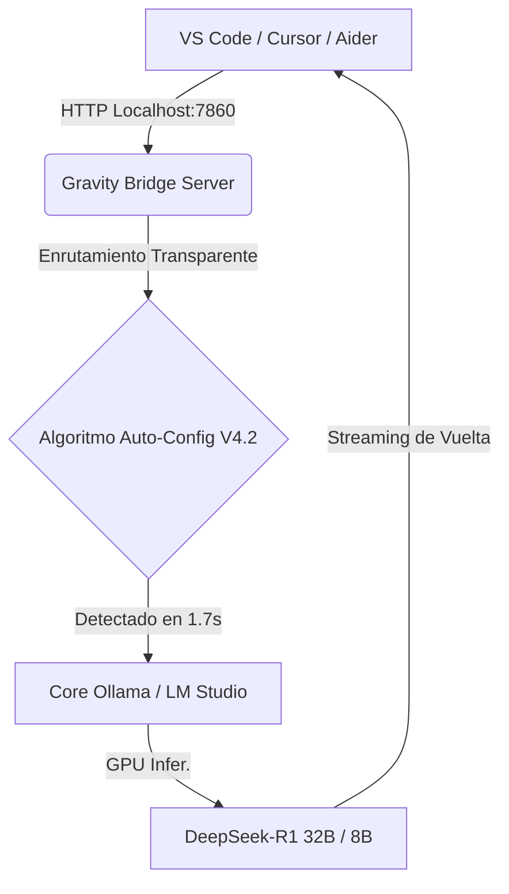

# GRAVITY AI BRIDGE V4.2 — MODO GOD-TIER ⚡
### El Motor de Inteligencia Perimetral Oficial del Séquito del Terror.

*“No envíes tu código al exterior. Forjamos la red dentro de nuestras propias sombras.”*

 

**Gravity AI Bridge** no es un simple script. Es una arquitectura **Enterprise de Enrutamiento Neuronal** diseñada para buscar, afianzar e interceptar la latencia de tu motor de Inteligencia Artificial Local (DeepSeek-R1, Ollama, LM Studio, Jan, etc.) y unificarlo en un hilo directo con todo tu entorno de desarrollo. Actúa como el *"Cerebro"* de tus IDEs y terminales sin soltar un solo byte de datos a internet.

---

## 📜 Tabla de Contenidos
- [Arquitectura de Alto Nivel](#-arquitectura-de-alto-nivel)
- [Instalación Rápida "Zero-Touch"](#-instalación-rápida-zero-touch)
- [El Arsenal del Auditor (CLI)](#-el-arsenal-del-auditor-cli)
- [Modo Fantasma y Despliegue Silencioso](#-modo-fantasma-y-despliegue-silencioso)
- [Documentación Técnica Oficial](#-documentación-técnica-oficial)
- [Desinstalación Limpia](#-desinstalación-limpia)

---

## 🖧 Arquitectura de Alto Nivel

Gravity V4.2 reemplaza la inestabilidad de los middlewares habituales por un **Scanner Asincrónico** que realiza un profiling de tu computadora. 

### ✨ Funciones Centrales:
1. **Telemetría Zero-Touch (Hardware Scanner):** Su módulo detecta si Ollama o LM Studio están vivos en 1.7 segundos y te "roba" el mejor modelo de la lista automáticamente.
2. **IDE Inyección:** Se sincroniza nativamente mediante `.continue/config.yaml`, perfiles de *Cursor* y configuraciones CLI de *Aider* sin que tú toques el código JSON.
3. **Persistencia de Contexto (`_history.json`):** Tu IA local recuerda sus instrucciones anteriores, sus conocimientos (`_knowledge.json`) y sus reglas de formato a lo largo de los reinicios.
4. **Protección de Efectos Secundarios:** Diseño aislado anti-crashes con encapsulación en Python puro frente a errores en comandos de Windows.

---

## 🚀 Instalación Rápida "Zero-Touch"

Transformar tu computadora en una base estricta del Séquito te lleva un solo clic.

**Paso a Paso:**
1. Clona el repositorio íntegro en cualquier ubicación definitiva de tu SSD.
2. Ejecuta **`INSTALAR.bat`**.
3. El sistema hará lo siguiente **mágicamente**:
   * Descargará librerías (`rich`, `pyreadline3`, etc.).
   * Auditará tu anillo de red local y ajustará `_settings.json` al mejor modelo que tengas disponible (Ej. `deepseek-r1:32b`).
   * Creará el acceso global `gravity` inyectándolo profundamente en tu **PATH** de Windows.
   * Generará tu engranaje de ícono nativo `Gravity AI Auditor` directamente en tu Escritorio (resolviendo tu OneDrive de forma dinámica).
4. Dale doble clic al ícono de tu Escritorio o escribe `gravity "!info"` en tu terminal. Estás dentro.

---

## 🥷 El Arsenal del Auditor (CLI)

Gravity provee un cliente directo de consola que sirve como tu "ChatGPT Táctico Local". Abre tu CMD nativo o pulsa en el ícono del escritorio. 

Si escribes tu petición normal, responderá. Pero si invocas sus "comandos en crudo", despertarás sus capacidades de lectura extrema:

| Comando Invocado | Destino Táctico |
| :--- | :--- |
| **`!integrar <app>`** | Genera la arquitectura `.json` obligando a `vscode`, `cursor` o `aider` a mirarnos. O usa `!integrar todo`. *(Ver [MANUAL_IDE](MANUAL_IDE.md))* |
| **`/leer <archivo>`** | Arrastra el código íntegro a su cerebro (Ej: `/leer src/main.py`). Perfecto para enviar errores completos a la IA local. |
| **`/leer-git`** | Realiza un `git diff` asincrónico instantáneo para que te audite qué has modificado en los últimos 5 minutos sin subir a main. |
| **`/leer-url <web>`** | Accede al link, raspa su documentación y la somete al límite cognitivo de tu hardware. |
| **`!aprende <regla>`** | Graba código a nivel BIOS de IA. Por ejemplo: `!aprende Eres un ingeniero Senior agresivo, solo das código exacto`. |
| **`!comprimir`** | Cuando pases de los 8000 tokens en memoria y tu gráfica sufra, purga tu archivo JSON interno y extrae un resumen del hilo, matando la basura. |
| **`!guardar <snap>`** | Realiza un backup de sus recuerdos bajo ese nombre. Ej: `!guardar fixing-login`. |
| **`!saves`** | Lista todas tus cápsulas de memoria y cárgalas instantáneamente escribiendo su nombre. |

---

## 👻 Modo Fantasma y Despliegue Silencioso

Si no deseas tener la consola ejecutándose en la pantalla mientras programas usando tu IDE (Visual Studio Code):

1. Ve a la carpeta madre de tu proyecto.
2. Da doble clic a **`MODO_FANTASMA.vbs`**.
3. El script asimilará Python mediante scripts de **Visual Basic**, ejecutando tu puente de datos de forma oculta en segundo plano. Nunca te molestará.
4. Todo el historial y tráfico de red entre tu IDE y el servidor será documentado en texto plano dentro de **`bridge.log`** para ti.

---

## 📚 Documentación Técnica Oficial

Los Archivos Supremos se extienden a lo largo de este repositorio corporativo para tu beneficio. Léelos aquí:

1. **🛠 [Manual de Integración IDE Exacta (Cursor, VS Code, Aider)](MANUAL_IDE.md)**  
   *Cómo conectar efectivamente las extensiones de programación del mercado.*
2. **⚠️ [Solución de Conflictos: Preguntas Frecuentes (FAQ)](FAQ.md)**  
   *Respuestas frente a problemas de Red, timeout y GPU.*
3. **🦾 [Manual de Delegación Táctica (IA Híbrida)](MANUAL_DELEGACION.md)**  
   *Instrucciones de Inyección Pura para que Antigravity actúe solo en nuevos proyectos.*

---

## 🗑️ Desinstalación Limpia

Somos un Séquito estructurado y profesional, no malware.
Si tu núcleo está corrompido, si necesitas migrar y barrer tu `PATH` global de Windows o si deseas destruir la telemetría automática:

Basta con dar doble clic al programa **`DESINSTALAR.bat`**. Éste activará un borrado quirúrgico mediante secuencias condicionales, retirará su nombre del registro informático, aplastará el ícono y te liberará. Tus archivos clave (`_history.json` y `_knowledge.json`) permanecerán pacíficamente congelados en su directorio por si alguna vez deseas revivir el motor.

 

<b>Construido bajo fuego. Gravity V4.2.</b>

