<div align="center">


# GRAVITY AI BRIDGE V5.1 — GOD EMPEROR ⚡
### El Motor de Inteligencia Perimetral Oficial del Séquito del Terror.

[](https://github.com/DarckRovert/Gravity_AI_bridge)
[](#)
[](#)
[](#)

*"No envíes tu código al exterior. Forjamos la red dentro de nuestras propias sombras."*
</div>

<br/>

**Gravity AI Bridge** es una arquitectura **Enterprise de Enrutamiento Neuronal** que detecta, optimiza y controla todos los motores de IA local de tu sistema desde un punto único, con selección automática de modelo según el tipo de tarea, cuantización de KV-Cache estilo TurboQuant (Google DeepMind) y optimización automática de hardware.

---

## 📜 Tabla de Contenidos
- [Arquitectura V5.1](#-arquitectura-v51)
- [Sistemas Inteligentes](#-sistemas-inteligentes)
- [Instalación Zero-Touch](#-instalación-zero-touch)
- [Modelos Recomendados (Lemonade)](#-modelos-recomendados-lemonade)
- [El Arsenal del Auditor CLI](#-el-arsenal-del-auditor-cli)
- [Documentación Técnica](#-documentación-técnica)

---

## 🖧 Arquitectura V5.1

```mermaid
graph TD;
    U[("Tu Query (Terminal)")] --> M(["model_selector.py"]);
    
    subgraph "GRAVITY AI V5.1 GOD EMPEROR"
        M -->|Clasifica| C{"¿Código o Razonamiento?"}
        C -->|Elige| Cache("Caché de Modelos Activos\n(Nunca 2 simultáneos)")
        
        Cache --> W(["engine_watchdog.py"])
        
        W -->|"Cada 30s escanea"| D("Ollama / Lemonade / LM Studio")
        W -->|"Auto Switch"| E(["env_optimizer.py"])
        
        E -->|"Inyecta Flags"| HW(["hardware_profiler.py"])
        HW -->|"Detecta 780M / VRAM"| TK(["turbo_kv.py"])
    end
    
    TK -->|"q4_0 KV-Cache"| F[("Inferencia 4x Menos RAM (TurboQuant)")]
    
    style U fill:#1b1b1b,stroke:#0ffff,color:#fff
    style M fill:#223344,stroke:#3388ff
    style W fill:#223344,stroke:#3388ff
    style E fill:#223344,stroke:#3388ff
    style HW fill:#223344,stroke:#3388ff
    style TK fill:#223344,stroke:#3388ff
    style F fill:#0a3a2a,stroke:#00ff55,color:#fff
```



---

## 🧠 Sistemas Inteligentes

### 1. Smart Model Selector (`model_selector.py`)
Selecciona automáticamente el mejor modelo para cada tipo de tarea. **Nunca carga dos modelos al mismo tiempo.**

| Tipo de Tarea | Palabras Clave Detectadas | Modelo Elegido |
|---|---|---|
| **Código** | `audita`, `bug`, `.py`, `/leer`, `función`, `refactor`... | Qwen2.5-Coder |
| **Razonamiento** | `explica`, `por qué`, `analiza`, `compara`, `arquitectura`... | DeepSeek-R1 |
| **General** | Cualquier otra consulta | El más rápido disponible |

### 2. Engine Watchdog (`engine_watchdog.py`)
Hilo demonio que cada 30 segundos:
- Escanea todos los puertos (Ollama:11434, Lemonade:8000/8080, LM Studio:1234, KoboldCPP:5001, Jan AI:1337)
- Actualiza el caché de modelos disponibles para el selector
- Hace auto-switch transparente si un motor nuevo aparece o desaparece

### 3. Environment Optimizer (`env_optimizer.py`)
Inyecta las variables de entorno óptimas **por motor** sin sobreescribir tu configuración manual:

| Motor | Variables Inyectadas |
|---|---|
| **Ollama** | `FLASH_ATTENTION=1`, `KV_CACHE_TYPE=q4_0`, `VULKAN=1` (AMD), `HSA_OVERRIDE_GFX_VERSION=11.0.0` |
| **Lemonade** | `LEMONADE_LLAMACPP=rocm/cuda/vulkan`, pre-warm via `/api/v1/load` |
| **LM Studio** | `num_ctx` dinámico desde `/v1/models`, `cache_prompt=true` |
| **KoboldCPP** | `blasbatchsize` calculado por VRAM, Flash Attention |
| **Jan AI** | `ngl=-1` (todas las capas en GPU), `ctx_len` por VRAM |

### 4. Hardware Profiler (`hardware_profiler.py`)
Detecta GPU, VRAM y calcula el contexto máximo posible:
- **AMD Radeon 780M**: 11GB VRAM estimados (35% de 32GB RAM), GFX 11.0.0, ROCm
- **KV-Cache formula**: `ctx = (VRAM_MB × 0.45) / (model_B × kv_factor_MB)`

### 5. TurboQuant KV (`turbo_kv.py`)
Cuantización del KV-Cache basada en el paper de Google DeepMind (Marzo 2026):
- **Activo hoy**: `q4_0` = 4x reducción de RAM en atención
- **Preparado para**: TurboQuant real (6x) cuando llegue a Ollama stable — **cero cambios de código requeridos**

---

## 🚀 Instalación Zero-Touch

```bash
git clone https://github.com/DarckRovert/Gravity_AI_bridge.git
cd Gravity_AI_bridge
INSTALAR.bat
```

El instalador ejecuta **9 pasos automáticos**:
1. Verifica Python 3.10+
2. Actualiza pip
3. Instala dependencias
4. **Perfila tu hardware** (GPU/VRAM/backend)
5. Escanea motores de IA disponibles
6. Auto-configura el mejor motor detectado
7. **Inyecta variables de entorno optimizadas** permanentemente
8. Configura integraciones IDE (Continue.dev, Aider, Cursor)
9. Instala el comando global `gravity`

---

## 🍋 Modelos Recomendados (Lemonade)

Para tu hardware (AMD Ryzen 7 8700G, Radeon 780M, 32GB RAM compartida):

| Modelo | Tamaño | Para qué | Descargar en Lemonade |
|---|---|---|---|
| **Qwen2.5-Coder-14B-Instruct** | ~8.5GB Q4_K_M | Auditoría de código, generación, bugs | `bartowski/Qwen2.5-Coder-14B-Instruct-GGUF` |
| **DeepSeek-R1-Distill-Qwen-14B** | ~8.5GB Q4_K_M | Razonamiento, análisis, comparaciones | `bartowski/DeepSeek-R1-Distill-Qwen-14B-GGUF` |

> **Selección de cuantización:** Siempre elige **Q4_K_M** en el dropdown de Lemonade. Es el balance óptimo calidad/RAM y el más testeado.

---

## ⚔️ El Arsenal del Auditor CLI

```bash
gravity "tu pregunta"                    # Consulta directa
gravity "!info"                          # Panel de hardware + estado del sistema
gravity "!selector tu pregunta"          # Preview: qué modelo elegiría el sistema
gravity "!scan"                          # Escanear todos los motores de IA activos
gravity "!modelos"                       # Listar modelos disponibles por motor
gravity "/leer archivo.py"               # Inyectar archivo en contexto + auditar
gravity "/leer-carpeta src/"             # Inyectar proyecto completo (hasta 50k chars)
gravity "/leer-git"                      # Analizar git diff (cambios sin comitear)
gravity "/leer-url https://..."          # Extraer y analizar una URL

# Gestión de contexto
gravity "!comprimir"                     # Comprimir historial cuando se llena el contexto
gravity "!limpiar"                       # Borrar historial de sesión
gravity "!guardar nombre"               # Guardar snapshot de la conversación
gravity "!cargar nombre"                # Restaurar snapshot

# Configuración
gravity "!modo coder"                    # Cambiar modo (auditor/coder/creativo/revisor)
gravity "!usar modelo:tag"              # Forzar un modelo específico
gravity "!streaming"                     # Toggle streaming ON/OFF
gravity "!aprende regla"                # Enseñar regla permanente al sistema
```

---

## 📋 Documentación Técnica

| Archivo | Función |
|---|---|
| `ask_deepseek.py` | CLI principal, AuditorCLI, todos los comandos |
| `model_selector.py` | Clasificador de tareas y switcher de modelos |
| `engine_watchdog.py` | Hilo de auto-detección y auto-switch de motores |
| `hardware_profiler.py` | Detección de GPU, VRAM y cálculo de ctx óptimo |
| `env_optimizer.py` | Inyección de env vars por motor de IA |
| `turbo_kv.py` | Cuantización KV-Cache (TurboQuant-compatible) |
| `provider_scanner.py` | Scanner de puertos y detección de modelos |
| `auto_config.py` | Actualización automática de `_settings.json` |
| `bridge_server.py` | Servidor HTTP para integraciones IDE |
| `_settings.json` | Configuración activa del sistema |

---

<div align="center">
<br/>

[](LICENSE)
[](#)

*Gravity AI Bridge — Forjado en las sombras. Ejecutado en local.*

</div>
