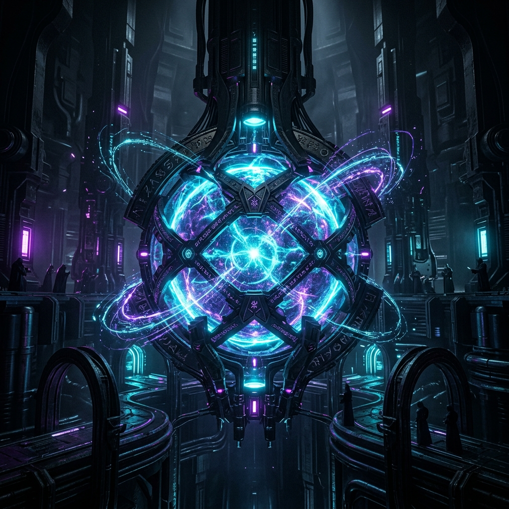

<div align="center">


# GRAVITY AI BRIDGE V7.0 — OMNI-TIER 🌐
### El Motor Universal de Orquestación e Inferencia Perimetral.

[](https://github.com/DarckRovert/Gravity_AI_bridge)
[](#)
[](#)
[](#)

*"No envíes tu código al exterior ciegamente. Forjamos la red dentro de nuestras propias sombras, expandiendo el horizonte a nuestro mando."*
</div>

<br/>

**Gravity AI Bridge V7.0 (Omni-Tier)** es una arquitectura **Enterprise de Enrutamiento Universal** que detecta, optimiza y controla absolutamente cualquier motor de IA: tanto locales (Ollama, LM Studio, Jan, Kobold) como infraestructuras Cloud (OpenAI, DeepSeek, Anthropic, Gemini, Grok, AWS). Opera desde un punto único con `Zero-Overhead`, proveyendo inyección modular de herramientas, un motor RAG Nativo en SQLite sin dependencias pesadas, y aseguramiento criptográfico DPAPI de credenciales.

---

## 📜 Tabla de Contenidos
- [Arquitectura V7.0 Omni-Tier](#-arquitectura-v70-omni-tier)
- [Capa de Proveedores Universales](#-capa-de-proveedores-universales-omni-tier)
- [Zero-Overhead RAG & Tools](#-zero-overhead-rag--tool-execution)
- [Instalación Zero-Touch](#-instalación-zero-touch)
- [El Arsenal del Auditor CLI](#-el-arsenal-del-auditor-cli)
- [Integración IDE Unificada (Cursor/Aider)](#-integración-ide-unificada-cursor-aider)

---

## 🖧 Arquitectura V7.0 Omni-Tier

```mermaid
graph TD
    U["Tu IDE o Terminal"]
    
    subgraph GRAVITY_AI ["GRAVITY AI V7 OMNI-TIER"]
        server["Universal SSE Proxy"]
        PM["Provider Manager"]
        localNode["Capa Local (Ollama)"]
        cloudNode["Capa Cloud (OpenAI)"]
        cost["Cost Tracker"]
        KM["Key Manager DPAPI"]
        tools["Tool Execution Engine"]
        rag["Dependency-Free RAG"]
    end
    
    U --> server
    server --> PM
    PM -->|Local Fallback| localNode
    PM -->|Cloud Routing| cloudNode
    PM --> cost
    KM -->|Provee Secretos| cloudNode
    PM --> tools
    PM --> rag
    
    style U fill:#1b1b1b,stroke:#0ffff,color:#fff
    style server fill:#223344,stroke:#ff00ff
    style PM fill:#ff8800,stroke:#ffffff,color:#000
    style localNode fill:#0a3a2a,stroke:#00ff55,color:#fff
    style cloudNode fill:#3a0a2a,stroke:#ff0055,color:#fff
```



---

## 🌩 Capa de Proveedores Universales (Omni-Tier)
A diferencia de versiones anteriores limitadas al perímetro local, la V7.0 unifica **cualquier API** adaptándola al estándar de inyección.

* **Locales Detectables (Auto-Port Scanning):** Ollama, LM Studio, KoboldCPP, Jan AI, Xinference, LocalAI, vLLM, TabbyAPI, Lemonade.
* **Cloud (Vía KeyManager DPAPI):** OpenAI, Anthropic Claude, Google Gemini, xAI (Grok), Mistral, DeepSeek, Firefox, Together, Perplexity, AWS Bedrock, HuggingFace, Azure OpenAI, Cohere.

## 🛠 Zero-Overhead RAG & Tool Execution
El sistema posee ahora la capacidad explícita de buscar en internet o ejecutar código aisladamente, con **dependencias mínimas reales** inyectadas directamente al modelo cargado:

1. **RAG Local:** Chunking de archivos (PDF/TXT/Code) inyectable de manera paralela. Usa TF-IDF (0 dependencias pesadas) como salvavidas o `sentence-transformers` en caso de existir la biblioteca.
2. **Bash & Code:** Ejecuta bloques de Python, PowerShell, Javascript directamente durante la inferencia y nutre la respuesta de vuelta al Auditor.
3. **Web Search:** Integración con DuckDuckGo API sin claves. Búsqueda semántica in-line en la consola.

---

## 🚀 Instalación Zero-Touch

```bash
git clone https://github.com/DarckRovert/Gravity_AI_bridge.git
cd Gravity_AI_bridge
INSTALAR.bat
```

1. Perfila tu hardware y tu ecosistema neuronal Local/Cloud.
2. Asegura localmente tu motor DPAPI (`pywin32` requerido).
3. Levanta el Bridge en segundo plano (`MODO_FANTASMA.vbs` o Server CLI).
4. Auto-configura tus extensiones IDE de desarrollo.

---

## ⚔️ El Arsenal del Auditor CLI

El comando unificado es tu punto de control sin salir de la consola:

```bash
gravity "/model"             # Panel UI interactivo para forzar modelo o saltar entre LMStudio/Ollama/DeepSeek.
gravity "/providers"         # Radar Ping/Latencia de nodos locales y cloud saludables.
gravity "/cost"              # Monitor de costes consumidos en APIs SaaS en USD hoy.
gravity "/search quantum"    # Inyecta los resultados de una búsqueda de web viva.
gravity "/rag variable"      # RAG inmediato sobre la documentación guardada en SQLite local.
gravity "/branch tesis"      # Crea un entorno de memoria forked para no manchar el contexto original.
gravity "/export"            # Exporta tu chat de código local a un index.html estilizado.
```

## 🔌 Integración IDE Unificada (Cursor, Aider)
Gravity V7 incluye el **Universal SSE Proxy** (`bridge_server.py`). Sin importar si el motor trasero es *Mistral-Local* vía LM Studio o Claude 3.5 Sonnet, el puente convierte cualquier token y payload stream en el estándar estructural **OpenAI**. 
Los IDEs recibirán tokens a 100~+ T/s con latencias ultra bajas y flush en tiempo real. 

Configuración general para cualquier IDE/Terminal:
* Base URL: `http://localhost:7860/v1`
* API Key: `gravity-local`
* Model: `gravity-bridge-auto`

---

<div align="center">
<br/>

[](LICENSE)
[](#)

*Gravity AI Bridge — Forjado en las sombras. Enrutando el cosmos.*

</div>
