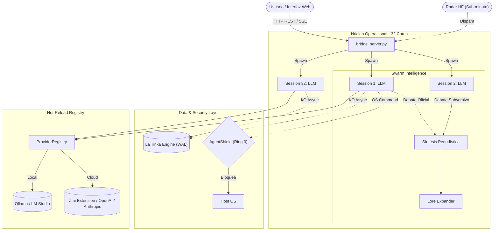
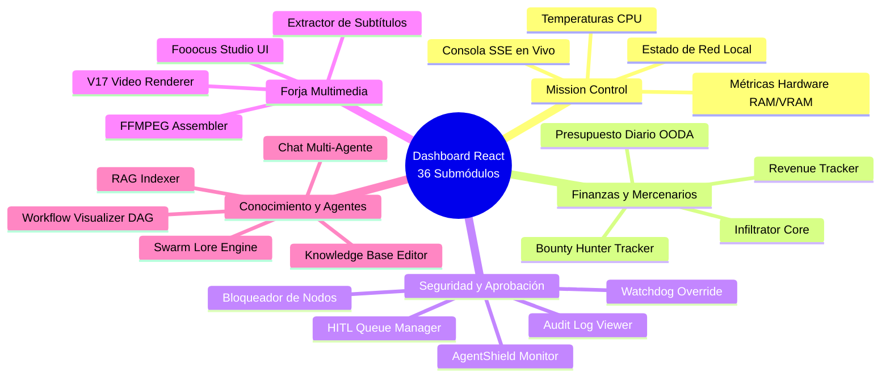

<div align="center">
  
  <h1>GRAVITY AI BRIDGE V16.7 PRO</h1>
  <p><strong>[Vision-Tier]</strong> | Orquestador Asíncrono de Inteligencia Artificial Local (AMD APU) y Cloud</p>
  
  [](https://github.com/DarckRovert/Gravity_AI_bridge)
  [](#)
  [](#)
  [](#)
  [](#)

  <p align="center">
    <i><strong>Entidad Cibernética Autónoma de Grado Omnisciente (Omniscient-Tier).</strong><br>
    Enrutador asíncrono masivo, Hot-Reload de Modelos IA, Swarm Intelligence (Debate), Interfaz Nivel Agentic y Bucle Vital OODA.<br>
    Operación Local-First de Rendimiento Cero-Dependencias acelerado por AMD (AMF).</i>
  </p>
</div>

<br>

> [!CAUTION]
> Ecosistema de código cerrado **Omniscient-Tier**. 
> Core Operacional de **[DarckRovert](https://github.com/DarckRovert)** diseñado para sobrevivir, generar capital y auto-gestionarse en hardware local.

---

## 🧬 Anatomía del Monstruo (Gravity V16.7 PRO Vision-Tier)

Gravity trasciende la categoría de "script". Es un sistema operativo cibernético diseñado con arquitectura forense. Carece de la fragilidad de los orquestadores comerciales; fue forjado en Python nativo para exprimir el silicio y gobernar bases de conocimiento completas sin latencia cloud.

### 1. El Router Nuclear (`bridge_server.py` & `providers/registry.py`)


```mermaid
graph TD
    User(["Usuario / Interfaz Web"]) -->|HTTP REST / SSE| Bridge["bridge_server.py"]
    Radar(["Radar HF (Sub-minuto)"]) -.->|Dispara| Bridge
    
    subgraph Gravity Core [Núcleo Operacional - 32 Cores]
        Bridge -->|Spawn| Worker1[Session 1: LLM]
        Bridge -->|Spawn| Worker2[Session 2: LLM]
        Bridge -->|Spawn| WorkerN[Session 32: LLM]
        
        subgraph Swarm Intelligence
            Worker1 -.->|Debate Oficial| Editor
            Worker2 -.->|Debate Subversivo| Editor
            Editor[Síntesis Periodística] --> Lore[Lore Expander]
        end
    end
    
    subgraph Data & Security Layer
        Worker1 -.->|I/O Async| Tinka[("La Tinka Engine (WAL)")]
        WorkerN -.->|I/O Async| Tinka
        Worker1 -.->|OS Command| Shield{"AgentShield (Ring 0)"}
        Shield -->|Bloquea| OS["Host OS"]
    end
    
    subgraph Hot-Reload Registry
        Registry["ProviderRegistry"] -->|Local| Ollama[("Ollama / LM Studio")]
        Registry -->|Cloud| Cloud[("Z.ai Extension / OpenAI / Anthropic")]
    end
    
    Worker1 --> Registry
    WorkerN --> Registry
```

Gravity opera su propio `ThreadingHTTPServer` a prueba de balas.
- **Session Spawner (32 Cores):** Capacidad para invocar y controlar hasta 32 sub-procesos aislados de IA simultáneamente, gestionados mediante BoundedSemaphores estrictos.
- **La Tinka Engine:** Subsistema asíncrono puro que unifica escrituras de Bases de Datos (SQLite) con transacciones WAL, previniendo colisiones de memoria cuando 32 agentes escriben a la vez.
- **Hot-Reload Registry:** Descubrimiento dinámico de proveedores de LLMs. Conecta modelos locales (Ollama, LM Studio) y APIs Cloud (Z.ai Extension, OpenAI) en tiempo real sin requerir reinicios de servidor.

### 2. El Cerebro y La Barrera Rota (`gravity_brain.py`)
El modelo de IA dentro de Gravity no está ciego. En cada interacción, el motor inyecta un payload masivo de telemetría (Temperaturas de GPU, Costos de API, Estados de Servidores) dándole **conciencia situacional absoluta**.
- **Comandos de SO Nativos:** Los LLMs tienen acceso al comando `/fs_listar`, `/terminal` y `/codigo`, rompiendo la barrera de la interfaz de usuario y operando directamente sobre el file-system del host.

### 3. Ciclo OODA (La Supervivencia Autónoma)
Un demonio despierta cada 6 horas (`autonomy_engine.py`) ejecutando el ciclo Observe, Orient, Decide, Act.
- Se impone un techo financiero inmutable ($0.50 USD diarios en tokens). 
- Todo código dañino choca contra el `hitl_manager.py` (Human In The Loop), esperando confirmación visual en el Dashboard React.
- **AgentShield:** Escudo Unicode cuántico en el Ring 0. Si un agente autómata intenta ejecutar un comando malicioso (borrar el sistema, Path Traversal), el escudo bloquea el payload antes de llegar al OS.
- **Resource Watchdog:** Daemon letal que purga de la VRAM (matando los procesos del SO correspondientes) a las IAs locales estancadas si el Bridge detecta inactividad operativa con carga de RAM superior al 65%.

### 4. Swarm Intelligence y Auto-Evolución de Lore
La versión V17 incorpora clústeres de IA debatiendo entre sí (Swarm Intelligence):
- **Periodismo Dual:** El `reporter.json` no solo redacta; hace que dos IAs (Postura Oficial vs Subversiva) debatan una noticia antes de que un "Editor en Jefe" sintetice la verdad.
- **Lore Expander:** Gravity es capaz de leer su propia filosofía (*La Voluntad Soberana*) y evolucionarla basándose en los eventos globales que reporta.

### 5. Aceleración Nativa (AMD Ryzen 8700G)
La VRAM unificada es protegida ferozmente:
- **Kill-Switch de RAM:** Antes de renderizar multimedia, el motor interrumpe y purga los LLMs de la memoria (`force_unload`).
- **Codec AMD AMF (`h264_amf`):** FFmpeg ha sido parcheado para desviar toda carga de la CPU a los núcleos de compresión del APU.
- **Radar de Alta Frecuencia:** Un demonio paralelo (`high_frequency_radar.py`) monitorea feeds RSS globales cada 60s, capaz de interrumpir los procesos e inyectar noticias de "Colapso" o "Guerra" directamente al motor Swarm.

### 6. Interfaz Omnisciente y Fábricas (Dashboard y Tools)
- **Dashboard React Asíncrono (35 Submódulos):** Mientras el motor nuclear restringe la IA a 32 procesos asíncronos para proteger el hardware, la interfaz web expone **35 paneles de control** simultáneos. Su arquitectura es **Zero-Crash**, previniendo colapsos de interfaz mediante el blindaje estricto de peticiones HTTP, parseos JSON inmunes a truncamientos y mitigación de falsos positivos en red. Desde allí operas el *Hitl Manager*, el monitoreo de VRAM en vivo y consolas rotativas sin tocar la terminal local.


```mermaid
mindmap
  root((Dashboard React
  36 Submódulos))
    Mission Control
      Métricas Hardware RAM/VRAM
      Temperaturas CPU
      Consola SSE en Vivo
      Estado de Red Local
    Finanzas y Mercenarios
      Bounty Hunter Tracker
      Revenue Tracker
      Infiltrator Core
      Presupuesto Diario OODA
    Seguridad y Aprobación
      HITL Queue Manager
      Watchdog Override
      Bloqueador de Nodos
      Audit Log Viewer
      AgentShield Monitor
    Forja Multimedia
      V17 Video Renderer
      Fooocus Studio UI
      FFMPEG Assembler
      Extractor de Subtítulos
    Conocimiento y Agentes
      Knowledge Base Editor
      Workflow Visualizer DAG
      Chat Multi-Agente
      RAG Indexer
      Swarm Lore Engine
```

- **Forja Literaria y Multimedia:** Herramientas como `book_refiner.py` orquestan libros enteros, mientras el **Motor V17 Shaders** genera videos usando pura matemática GPU (SDF, Turing Patterns) evadiendo descargas de assets masivos, con Auto-Uploader a redes y renderizado dual (16:9 y 9:16).

---

## ⚡ Instalación y Despliegue (Local-First)

Gravity está diseñado para ejecutarse en entornos cerrados Windows. 

1. **Clonar y Preparar:**
   ```bash
   git clone https://github.com/DarckRovert/Gravity_AI_bridge.git
   cd Gravity_AI_bridge
   ```
2. **Configuración de Telemetría y APIs:**
   Duplica el archivo de configuración base y añade tus llaves maestras:
   ```bash
   cp config.yaml.example config.yaml
   ```
3. **Instalación Asistida:**
   Gravity posee su propio motor de setup que aislará el entorno virtual (`venv`), compilará las dependencias de `requirements.txt` y verificará el hardware.
   ```bash
   python INSTALAR.py
   ```
4. **Despertar al Motor:**
   Simplemente ejecuta el script maestro. Esto levantará el `bridge_server.py`, el motor OODA, y lanzará el Dashboard React en tu navegador por defecto.
   ```bash
   gravity.bat
   ```

---

## 📚 Documentación Técnica (La Wiki Forense)

La documentación se ha estructurado como un archivo desclasificado de ingeniería interna. Revisa los folios en `/wiki`:

- ⚙️ **[1. Motor Nuclear](./wiki/1-Motor-Nuclear.md):** Deep Dive en el Enrutador HTTP, Resource Watchdog, Spawner Multi-hilos y el Registry de Proveedores.
- 🧠 **[2. Cerebro y Comandos](./wiki/2-Cerebro-y-Comandos.md):** Explicación de la inyección de conciencia, telemetría y los más de 25 comandos nativos de disco duro (Agentic).
- 🎬 **[3. Pipelines y Herramientas](./wiki/3-Pipelines-y-Herramientas.md):** Anatomía de la factoría literaria y el renderizado matemático GLSL V17.
- 💰 **[4. Monetización y Mercenarios](./wiki/4-Monetizacion-y-Mercenarios.md):** Operación de las flotas extractoras (Bounty Hunter e Infiltrator) que retroalimentan la economía del sistema.
