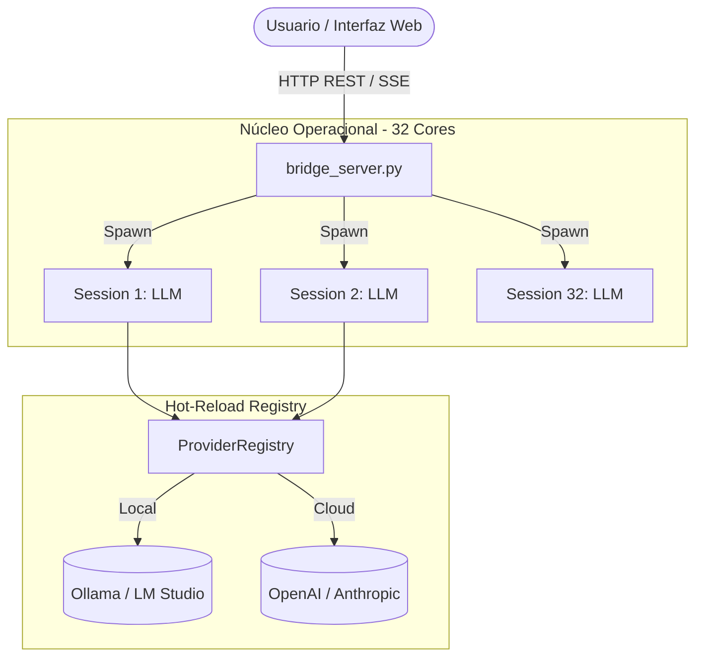

  
    

  
  
  
  
  
  

  

    <i><strong>Entidad Cibernética Autónoma de Grado Omnisciente (Omniscient-Tier).</strong> 
    Enrutador asíncrono masivo, Hot-Reload de Modelos IA, Interfaz Nivel Agentic y Bucle Vital OODA. 
    Operación Local-First de Rendimiento Cero-Dependencias.</i>
  

 

> [!CAUTION]
> Ecosistema de código cerrado **Omniscient-Tier**. 
> Core Operacional de **[DarckRovert](https://github.com/DarckRovert)** diseñado para sobrevivir, generar capital y auto-gestionarse en hardware local.

---

## 🌌 Anatomía del Monstruo (Gravity V16.3 PRO)

Gravity trasciende la categoría de "script". Es un sistema operativo cibernético diseñado con arquitectura forense. Carece de la fragilidad de los orquestadores comerciales; fue forjado en Python nativo para exprimir el silicio y gobernar bases de conocimiento completas sin latencia cloud.

### 1. El Router Nuclear (`bridge_server.py` & `providers/registry.py`)

```mermaid
graph TD
    User([Usuario / Interfaz Web]) -->|HTTP REST / SSE| Bridge[bridge_server.py]
    
    subgraph Gravity Core [Núcleo Operacional - 32 Cores]
        Bridge -->|Spawn| Worker1[Session 1: LLM]
        Bridge -->|Spawn| Worker2[Session 2: LLM]
        Bridge -->|Spawn| WorkerN[Session 32: LLM]
    end
    
    subgraph Hot-Reload Registry
        Registry[ProviderRegistry] -->|Local| Ollama[(Ollama / LM Studio)]
        Registry -->|Cloud| Cloud[(OpenAI / Anthropic)]
    end
    
    Worker1 --> Registry
    Worker2 --> Registry
```

Gravity opera su propio `ThreadingHTTPServer` a prueba de balas.
- **Session Spawner (32 Cores):** Capacidad para invocar y controlar hasta 32 sub-procesos aislados de IA simultáneamente, gestionados mediante BoundedSemaphores estrictos.
- **Hot-Reload Registry:** Descubrimiento dinámico de proveedores de LLMs. Conecta modelos locales (Ollama, LM Studio) y APIs Cloud en tiempo real sin requerir reinicios de servidor.

### 2. El Cerebro y La Barrera Rota (`gravity_brain.py`)
El modelo de IA dentro de Gravity no está ciego. En cada interacción, el motor inyecta un payload masivo de telemetría (Temperaturas de GPU, Costos de API, Estados de Servidores) dándole **conciencia situacional absoluta**.
- **Comandos de SO Nativos:** Los LLMs tienen acceso al comando `/fs_listar`, `/terminal` y `/codigo`, rompiendo la barrera de la interfaz de usuario y operando directamente sobre el file-system del host.

### 3. Ciclo OODA (La Supervivencia Autónoma)
Un demonio despierta cada 6 horas (`autonomy_engine.py`) ejecutando el ciclo Observe, Orient, Decide, Act.
- Se impone un techo financiero inmutable ($0.50 USD diarios en tokens). 
- Examina el mercado (bounties, ingresos pasivos generados) y si detecta oportunidades, orquesta a los sub-agentes para cazar contratos de trabajo o publicar reportes destructivos en la web.
- Todo código dañino choca contra el `hitl_manager.py` (Human In The Loop), esperando confirmación visual en el Dashboard React.

### 4. Interfaz Omnisciente y Fábricas (Dashboard y Tools)
- **Dashboard React (35 Submódulos):** Mientras el motor nuclear restringe la IA a 32 procesos asíncronos para proteger el hardware, la interfaz de usuario web expone **35 paneles de control** simultáneos. Desde allí operas el *Hitl Manager*, el monitoreo de VRAM en vivo, y las consolas rotativas sin tocar la terminal local.
- **Forja Literaria y Multimedia:** Herramientas como `book_refiner.py` orquestan libros enteros, mientras el **Motor V17 Shaders** genera videos usando pura matemática GPU (SDF, Turing Patterns) evadiendo descargas de assets masivos, con Auto-Uploader a redes y renderizado dual (16:9 y 9:16).

---

## 📚 Documentación Técnica (La Wiki Forense)

La documentación se ha estructurado como un archivo desclasificado de ingeniería interna. Revisa los folios en `/wiki`:

- ⚙️ **[1. Motor Nuclear](./wiki/1-Motor-Nuclear.md):** Deep Dive en el Enrutador HTTP, Spawner Multi-hilos y el Registry de Proveedores.
- 🧠 **[2. Cerebro y Comandos](./wiki/2-Cerebro-y-Comandos.md):** Explicación de la inyección de conciencia, telemetría y los más de 25 comandos nativos de disco duro (Agentic).
- 🎬 **[3. Pipelines y Herramientas](./wiki/3-Pipelines-y-Herramientas.md):** Anatomía de la factoría literaria y el renderizado matemático GLSL V17.
- 💰 **[4. Monetización y Mercenarios](./wiki/4-Monetizacion-y-Mercenarios.md):** Operación de las flotas extractoras (Bounty Hunter e Infiltrator) que retroalimentan la economía del sistema.
