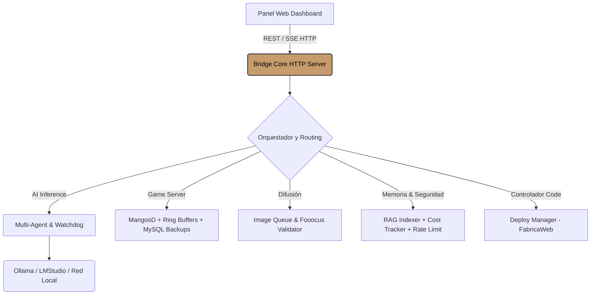

# 🪐 Gravity AI Bridge

  
  
  
  

 

**Gravity AI Bridge** es una superarquitectura de Inteligencia Artificial en puente local y Orquestación de Subprocesos HTTP desarrollada para soportar todo el ecosistema de automatizaciones locales de [DarckRovert](https://twitch.tv/darckrovert). No requiere nubes públicas; todo corre en la intranet bajo latencia-cero (zero-overhead loopless design).

## 🚀 Ecosistema Total de Tecnologías

Gravity Bridge sirve como un servidor multiproceso en Python que funciona puramente sobre `http.server` y consolida un **Suite Masivo de Inteligencias Artificiales y Sistemas Serverless**:

### 🧠 1. Multi-Agent Orchestrator
Enrutador cognitivo asíncrono para Inferencia cruzada. 
- Permite lanzar una misma Query a `n_models` en paralelo (Ollama, LM Studio, Kobold, Jan). 
- Contiene los métodos **`Compare`** (para contrastar alucinaciones) y **`Vote`** (ensamble para decidir el mejor resultado técnico evaluado por mayoría pasiva).
- Posee el **`Reasoning Stripper`**: Analizador de sintaxis en el pipeline de telemetría que destila outputs internos como `<think>` para modelos tipo DeepSeek y los entrega de forma procesada al usuario, desarticulando el caos de tokens.

### 🔌 2. Hardware Profiler & VRAM Engine Watchdog
El servidor realiza sondeos crudos sobre el *Bus PCI* buscando GPUs discretas y NPUs en la máquina huésped al instante del arranque.
- Se integra con un **Env_Optimizer** que, en caliente (on the fly), secuestra los cabezales del framework de inferencia y les asila hasta 16GB o 32GB de un Contextual Window dinámico (`num_ctx`), empujando los perfiles de limitación GGFU según los hilos (Threads) sobrantes que el OS reporta tener vivos.

### 🛡️ 3. RAG System Indexing & Session Manager
Un integrador local para retención de memoria (Retrieval-Augmented Generation).
- Crea colecciones masivas analizando tu directorio `_rag_index`. Genera hashes de archivos JSON con miles de *chunks* para enriquecer las respuestas de la IA sin exponer datos corporativos a la nube pública.
- Cuenta con **Session Manager** que respalda nativamente todo el chat interactivo como sesiones discretas hacia la carpeta inyectable `_saves/`.

### 🏦 4. Cost Tracker & Limitaciones Estáticas
Supervisa drásticamente el consumo si empleas endpoints tarifados de Cloud Providers inyectados en la Suite.
- Computa precios estipulados de Tokens_IN y Tokens_OUT al micro-dólar garantizando cortes si alcanzas barreras de seguridad financieras (`Daily Thresholds`). 

### ⚙️ 5. World Of Warcraft: Game Server Manager
Una central dedicada para conectar o detener de manera automatizada subprocesos compilados como `mangosd.exe`.
- **Live Memory Hooks:** Emplea buffers vivientes nativos (`collections.deque(maxlen=500)`) tragándose el texto de Standard Output que entrega MangosD a costo VRAM microscópico, sirviendo un Panel de lectura Log HTTP al front end.
- **Seguridad MySQL Integral:** Nadie levanta el server Vanilla sin antes sobrepasar un **Pre-Flight Lock** el cual verifica que el puerto MySQL esté emitiendo, auto-invocando comandos `mysqldump` al detener la máquina para garantizar persistencia sin corrupción en base de datos.

### 🎨 6. Orquesta Fooocus (Difusivo por Rest Bypassing)
La clásica generación ininterrumpida de renderizados a Gradio.
- Realiza sub-procesamiento difusivo y garantiza (pasivamente) la verificación del trabajo leyendo diferenciales físicos (File set diffings) dentro de los discos base (`outputs`). Desarticula Falsos Positivos de generación asegurando integridad binaria.
- Todo progreso es retornado vivo al front-end en forma de telemetría **Event-Stream (SSE)** reduciendo asfixia HTTP (Polling manual eliminado).

## 🪟 Arquitectura Base

```mermaid
graph TD
    A[Panel Web Dashboard] -->|REST / SSE HTTP| B(Bridge Core HTTP Server)
    B --> C{Orquestador y Routing}
    C -->|AI Inference| D[Multi-Agent & Watchdog]
    C -->|Game Server| E[MangosD + Ring Buffers + MySQL Backups]
    C -->|Difusión| F[Image Queue & Fooocus Validator]
    C -->|Memoria & Seguridad| G[RAG Indexer + Cost Tracker + Rate Limit]
    C -->|Controlador Code| H[Deploy Manager - FabricaWeb]
    D --> I(Ollama / LMStudio / Red Local)
    
    style B fill:#c69c6d,stroke:#333,stroke-width:2px,color:#000
```

## 🔐 Seguridad y Limitadores Incluidos

Debido a que levanta APIs sensibles bajo LAN, la **V10.1** está artillada:
1. **Saturador Anti-DDoS:** Limitas 120 peticiones por nodo a cada IP conectada bajo una métrica unificada de 60 Segundos con bloqueos automáticos `HTTP 429`.
2. **Purgador pasivo SQLite:** Toda inyección de memoria estática SQLite usa `PRAGMA wal_checkpoint(TRUNCATE)` purgando logs inútiles del subproceso "Write Ahead" a base.
3. **Audit Log con Rotación Automática:** Toda solicitud cruza la terminal de seguridad, pero con un cortafuegos físico de 5 Megabytes (Se empaqueta automáticamente el log como .pak previniendo colapso de SSD de la IA).

> [!CAUTION]
> Esta arquitectura está protegida y es propietaria. Bajo ninguna circunstancia está permitido el fork de los sistemas o el API a plataformas externas.
