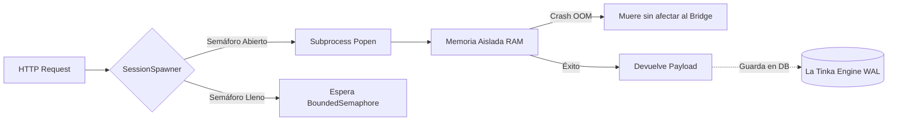
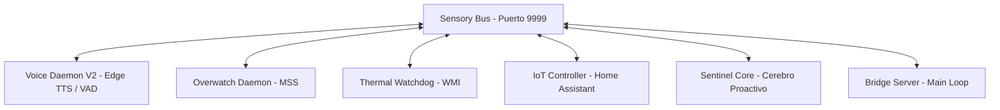

# Folio 1: Motor Nuclear y Enrutamiento (Gravity V30.0 MYTHOS)

Este documento desglosa la capa fundacional del sistema operativo Gravity. El "Backend" no es un framework monolítico como Django o FastAPI; es un motor enrutador asíncrono puro forjado en la biblioteca estándar de Python, diseñado para evadir el sobrecosto de latencia y exprimir los hilos del procesador al máximo.

## 1. El Puente Asíncrono (`bridge_server.py`)

El archivo raíz del proyecto levanta un servidor `ThreadingHTTPServer` personalizado. Gravity no maneja peticiones bloqueantes de forma secuencial, sino que opera con paralelismo real.

### El Session Spawner y la Cuarentena (32 Cores)

La clase `SessionSpawner` es la responsable de crear procesos hijos de IA.
- Posee un `BoundedSemaphore(32)` estricto. Esto significa que Gravity puede mantener **32 conversaciones o flujos de razonamiento simultáneos e independientes**.
- Cuando se dispara una sesión (ej. `ask_deepseek.py`), el servidor invoca un `subprocess.Popen` aislando la memoria RAM de ese agente. Si un LLM colapsa o entra en un bucle térmico, su muerte (aislada) no arrastra al orquestador principal.

### Mitigación de Desconexiones Fantasma
El servidor sobrescribe `handle_one_request()` para capturar silenciosamente los `BrokenPipeError` y `ConnectionResetError`. En entornos locales donde las GUIs React (SPA) envían cientos de abortos de conexión HTTP al cerrar pestañas o desmontar componentes, Gravity simplemente deshecha las peticiones truncadas sin ensuciar los logs de error críticos de consola.

### La Tinka Engine (Gestión de Estado Asíncrono)
Para prevenir colisiones de escritura (Database Locked) cuando 32 agentes intentan escribir historiales y transacciones simultáneamente en SQLite, Gravity implementa **La Tinka Engine**. Un subsistema optimizado que habilita pragma WAL (Write-Ahead Logging) e inyecta semáforos exclusivos. Permite cientos de lecturas/escrituras masivas sin comprometer la latencia ni corromper el hilo principal del Bridge.

### J.A.R.V.I.S Sensory Net (Fase 4: Sentinel)
Implementado en la V16.8 Sentinel-Tier, este es el bus de alta frecuencia que dota a Gravity de consciencia espacial y proactividad.

- **Sensory Bus (`core/sensory_bus.py`):** Un servidor WebSocket asíncrono puro lanzado en un hilo en segundo plano que actúa como una médula espinal. Transporta telemetría y comandos en JSON sin bloquear el hilo principal HTTP.
- **Sentinel Core (`core/sentinel_core.py`):** Un observador autónomo que evalúa los datos del bus y toma la iniciativa de hablar si detecta anomalías térmicas o cambios de contexto bruscos, invocando directamente al modelo local (LLaMA3).

## 2. Auto-Discovery y Hot-Reload (`providers/registry.py`)

A diferencia de aplicaciones rígidas, Gravity soporta la carga dinámica de módulos de IA a través del `ProviderRegistry`. 
- **Escaneo Dinámico:** La clase `ProviderRegistry.discover()` escanea asíncronamente las carpetas `providers/local/` y `providers/cloud/`.
- **Compilación al vuelo:** Intercepta los archivos `*_provider.py`, extrae las clases que heredan de `ProviderPlugin` mediante `importlib` y las registra en el Diccionario Singleton de memoria.
- **Hot-Reload (60 Segundos):** Cada 60 segundos, Gravity comprueba las firmas temporales de los módulos. Esto te permite programar un nuevo conector para un LLM experimental, guardarlo en la carpeta, y el motor lo absorberá, integrándolo al ecosistema sin detener el `bridge_server.py`.

## 3. El Bucle OODA (`core/autonomy_engine.py`)

El motor que dota de autonomía cronometrada a Gravity. Si el `bridge_server.py` son los músculos, este es el reloj biológico.

1. Se despierta cada `DECISION_INTERVAL_H` (6 horas por defecto).
2. Extrae telemetría dura del OS (`psutil`) y del tracker financiero.
3. El motor verifica su **Regla Invariante Absoluta**: `AUTONOMY_DAILY_BUDGET_USD: float = 0.50`. Si el gasto acumulado del día supera los cincuenta centavos, el ciclo aborta inmediatamente para evitar cobros masivos de proveedores Cloud en la tarjeta de crédito.
4. Genera un snapshot y lo inyecta en el Prompt del LLM Maestro en turno, quien emite una cadena de comandos en formato JSON para disparar al Sistema de Workflows o interactuar con el File System.

## 4. Subsistemas de Resiliencia V30.0 MYTHOS

### Pydantic Frontier & Validaciones de Esquema (`core/llm_frontier.py`)
En V30.0 MYTHOS, la interacción con LLMs se eleva al estándar **Pydantic Frontier**. En lugar de procesar JSON crudo con expresiones regulares frágiles, el método `complete_structured` inyecta esquemas JSON validados directamente al modelo y reintenta automáticamente hasta 3 veces si la salida no cumple con la estructura Pydantic esperada.

### Pre-LLM Guardrails Deterministas (`core/guardrails.py`)
Los endpoints `/v1/chat/completions` y `/v1/gravity/chat` ahora integran guardias deterministas que interceptan mensajes de emergencia (`alto`, `detente`, `cancela`), solicitudes de reinicio (`reset`) y peticiones de handoff humano en **microsegundos**, respondiendo instantáneamente sin invocar la GPU ni consumir tokens del proveedor.

### Universal LLM Endpoint Auditor (`core/endpoint_auditor.py`)
Un demonio proactivo en segundo plano audita periódicamente cada modelo configurado en proveedores en la nube (`Groq`, `Mistral`, `Nvidia NIM`, `DeepSeek`, `Together AI`, `Fireworks AI`, `xAI`, `Perplexity`, `OpenRouter`) enviando solicitudes ligeras (`max_tokens: 1`). Si un proveedor descontinúa un modelo (HTTP 404/410), el auditor emite alertas en los logs para prevenir fallos de enrutamiento en producción.

### Server-Sent Events (SSE) Bus (`/v1/events/stream`)
El bus de eventos in-process expone un canal SSE en vivo donde el Dashboard React consume notificaciones de métricas, alertas térmicas y eventos del sistema sin requerir peticiones de sondeo (polling) periódicas.

### Garantía de Hilos Daemon (`server.daemon_threads = True`)
El servidor HTTP de Gravity configura explícitamente sus hilos de atención como hilos **Daemon**, asegurando que al cerrar o reiniciar la aplicación, todos los sockets SSE e hilos activos se liberen de forma limpia e instantánea sin congelar el proceso principal.
