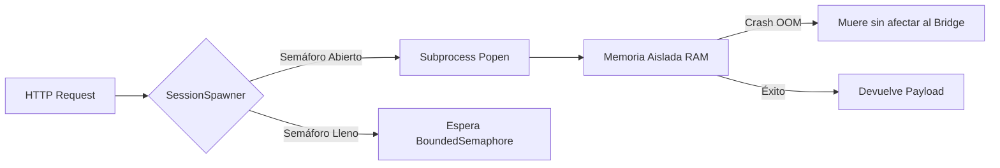

# Folio 1: Motor Nuclear y Enrutamiento (Gravity V16.4 PRO)

Este documento desglosa la capa fundacional del sistema operativo Gravity. El "Backend" no es un framework monolítico como Django o FastAPI; es un motor enrutador asíncrono puro forjado en la biblioteca estándar de Python, diseñado para evadir el sobrecosto de latencia y exprimir los hilos del procesador al máximo.

## 1. El Puente Asíncrono (`bridge_server.py`)

El archivo raíz del proyecto levanta un servidor `ThreadingHTTPServer` personalizado. Gravity no maneja peticiones bloqueantes de forma secuencial, sino que opera con paralelismo real.

### El Session Spawner y la Cuarentena (32 Cores)

La clase `SessionSpawner` es la responsable de crear procesos hijos de IA.
- Posee un `BoundedSemaphore(32)` estricto. Esto significa que Gravity puede mantener **32 conversaciones o flujos de razonamiento simultáneos e independientes**.
- Cuando se dispara una sesión (ej. `ask_deepseek.py`), el servidor invoca un `subprocess.Popen` aislando la memoria RAM de ese agente. Si un LLM colapsa o entra en un bucle térmico, su muerte (aislada) no arrastra al orquestador principal.

### Mitigación de Desconexiones Fantasma
El servidor sobrescribe `handle_one_request()` para capturar silenciosamente los `BrokenPipeError` y `ConnectionResetError`. En entornos locales donde las GUIs React (SPA) envían cientos de abortos de conexión HTTP al cerrar pestañas o desmontar componentes, Gravity simplemente deshecha las peticiones truncadas sin ensuciar los logs de error críticos de consola.

## 2. Auto-Discovery y Hot-Reload (`providers/registry.py`)

A diferencia de aplicaciones rígidas, Gravity soporta la carga dinámica de módulos de IA a través del `ProviderRegistry`. 
- **Escaneo Dinámico:** La clase `ProviderRegistry.discover()` escanea asíncronamente las carpetas `providers/local/` y `providers/cloud/`.
- **Compilación al vuelo:** Intercepta los archivos `*_provider.py`, extrae las clases que heredan de `ProviderPlugin` mediante `importlib` y las registra en el Diccionario Singleton de memoria.
- **Hot-Reload (60 Segundos):** Cada 60 segundos, Gravity comprueba las firmas temporales de los módulos. Esto te permite programar un nuevo conector para un LLM experimental, guardarlo en la carpeta, y el motor lo absorberá, integrándolo al ecosistema sin detener el `bridge_server.py`.

## 3. El Bucle OODA (`core/autonomy_engine.py`)

El motor que dota de autonomía cronometrada a Gravity. Si el `bridge_server.py` son los músculos, este es el reloj biológico.

1. Se despierta cada `DECISION_INTERVAL_H` (6 horas por defecto).
2. Extrae telemetría dura del OS (`psutil`) y del tracker financiero.
3. El motor verifica su **Regla Invariante Absoluta**: `AUTONOMY_DAILY_BUDGET_USD: float = 0.50`. Si el gasto acumulado del día supera los cincuenta centavos, el ciclo aborta inmediatamente para evitar cobros masivos de proveedores Cloud en la tarjeta de crédito.
4. Genera un snapshot y lo inyecta en el Prompt del LLM Maestro en turno, quien emite una cadena de comandos en formato JSON para disparar al Sistema de Workflows o interactuar con el File System.

### Resource Watchdog (Control de Fugas de VRAM/RAM)
El núcleo autónomo es escoltado por `core/resource_watchdog.py`. Una APU moderna (como la AMD Ryzen 7 8700G con Radeon 780M) comparte memoria RAM y VRAM dinámicamente. 
- En lugar de dejar procesos dormidos como zombies, el Watchdog inspecciona mediante `psutil` el árbol de procesos completo del sistema operativo.
- Si Gravity no registra *Jobs* en los últimos 120 segundos y la ocupación de memoria supera el 65%, desencadena la directiva `_kill_stray_ai_processes()`. Destruirá inmediatamente cualquier proceso de fondo relacionado a `comfyui`, `ollama` o `lm studio`, liberando los Gigabytes retenidos y garantizando que el sistema sea inmune a memory leaks crónicos.
