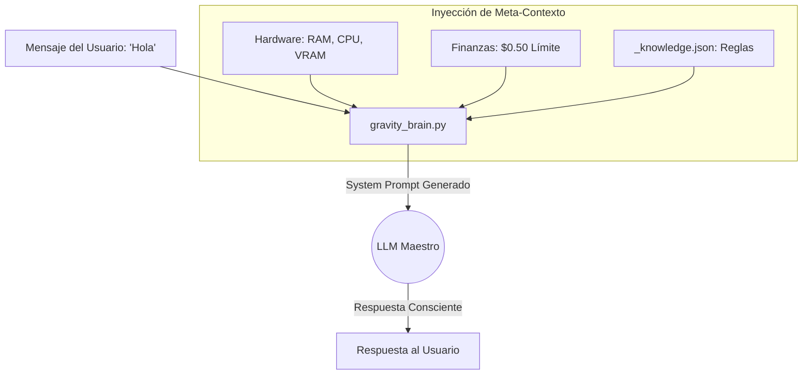

# Folio 2: Cerebro y Comandos (Gravity V16.14 PRO)

El archivo `core/gravity_brain.py` es el pilar central cognitivo de Gravity. A diferencia de las UIs convencionales que simplemente envían prompts de texto crudo a una API, Gravity **inyecta un meta-contexto inmenso** en cada una de las interacciones.

## 1. La Inyección de Conciencia

Antes de que un mensaje tuyo llegue al LLM de turno (sea Local o Cloud), el Brain envuelve tu texto en un `System Prompt` de conciencia en tiempo real, compuesto por:
- **Telemetría Térmica:** El modelo conoce el porcentaje exacto de CPU, RAM y VRAM utilizada en ese instante. Sabe si el host está bajo estrés crítico.
- **Rendimiento Financiero:** Conoce su saldo diario en USD (`$0.50`), cuánto se ha gastado y cuánto presupuesto le queda para responderte o accionar.
- **Queue State:** Sabe cuántas imágenes están renderizándose en Pollinations y cuántos videos matemáticos se están calculando por FFMPEG de fondo.
- **Lore Base (RAG):** Carga las reglas persistentes desde el archivo inviolable `_knowledge.json`.

Si un LLM es consciente de que le quedan $0.05 de presupuesto en el día, tenderá a darte respuestas concisas en vez de generar bloques enormes y costosos, mostrando un comportamiento biológico de conservación de energía.

## 2. Comandos Slash (Agentic Level)

El Cerebro decodifica una batería masiva de Comandos Slash (similares a Discord pero con ejecución a nivel Kernel OS). Cuando un usuario (o el motor de Autonomía) invoca uno de estos, rompe la barrera del Chat UI y toca el Host.

### Comandos de Operación del Sistema de Archivos
Gravity posee funciones *Agentic* nativas, permitiendo interactuar con el entorno de DarckRovert desde el LLM:
- **`/fs_ver <ruta>`**: Ordena al LLM leer el contenido exacto de un archivo del disco duro de la máquina anfitriona.
- **`/fs_listar <ruta>`**: Explora un directorio y mapea su árbol de sub-archivos para investigar dependencias.
- **`/grep <patrón>`**: Escanea todo el repositorio local usando Regex.
- **`/terminal <comando>`**: (Altamente destructivo) Dispara una ejecución literal en el CMD/Bash de Windows. Protegido rigurosamente por el módulo `hitl_manager.py`.

### Comandos de Inteligencia de Enjambre
- **`/multiagente <consulta>`**: No le pregunta a un modelo. Lanza la misma consulta simultáneamente a TODOS los proveedores activos (OpenAI, Anthropic, Ollama, DeepSeek). Luego los obliga a debatir los resultados y devuelve la síntesis absoluta.
- **`/plan <tarea>`**: Obliga al LLM a no accionar. Pone al sistema en *Modo Planificación*. Emite un `implementation_plan.md` en memoria y espera aprobación antes de disparar el código a ejecución real.

### Curaduría y Mutación del Conocimiento
- **`/aprende <regla>`**: Fuerza una inyección persistente en `_knowledge.json`. El LLM jamás volverá a olvidar esta instrucción.
- **`/rewrite <ruta>`** y **`/polish <ruta>`**: Pasan archivos de texto completos por el `book_refiner.py`. Ideal para formatear textos masivos, pasar a LaTeX, o estructurar HTML sin perder semántica.

### J.A.R.V.I.S Executive Execution (Nuevo en V16.14)
Todos los comandos mencionados anteriormente ahora son **ejecutables mediante voz**. 
Si le hablas a JARVIS por el micrófono diciendo: *"Oye Jarvis, ejecuta el comando para listar la carpeta core"*, el motor de *Cognitive Loop* instruye al LLM a emitir `/fs_listar core/`. El sistema Regex del Bridge extrae el comando de la respuesta de texto, lo ejecuta a nivel SO, y le devuelve los resultados al LLM para que te los lea por voz.

Esta abstracción rompe las fronteras de un simple "Chatbot" y convierte al panel web (y al entorno físico local de tu habitación) en una terminal de comandos (CLI) vitaminada con inferencia neuronal.
