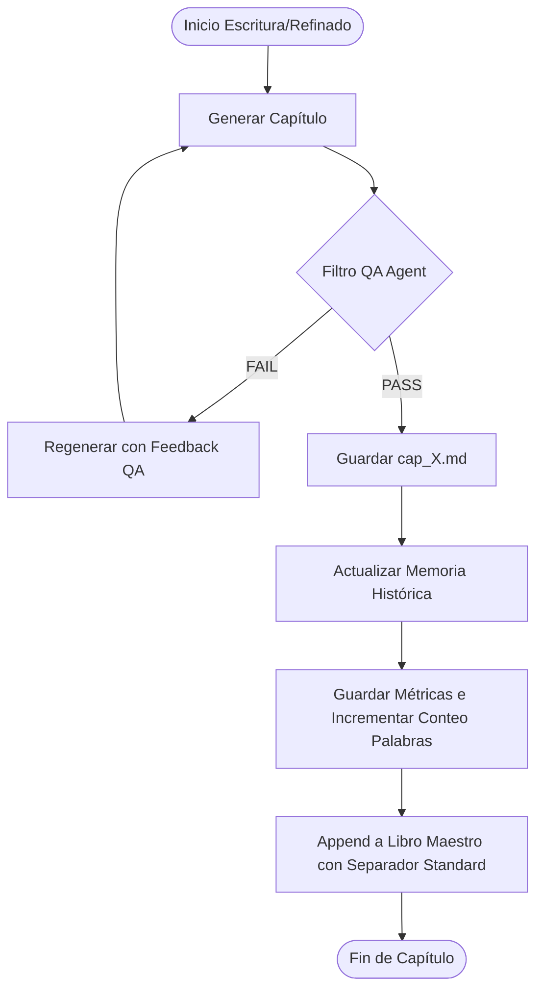
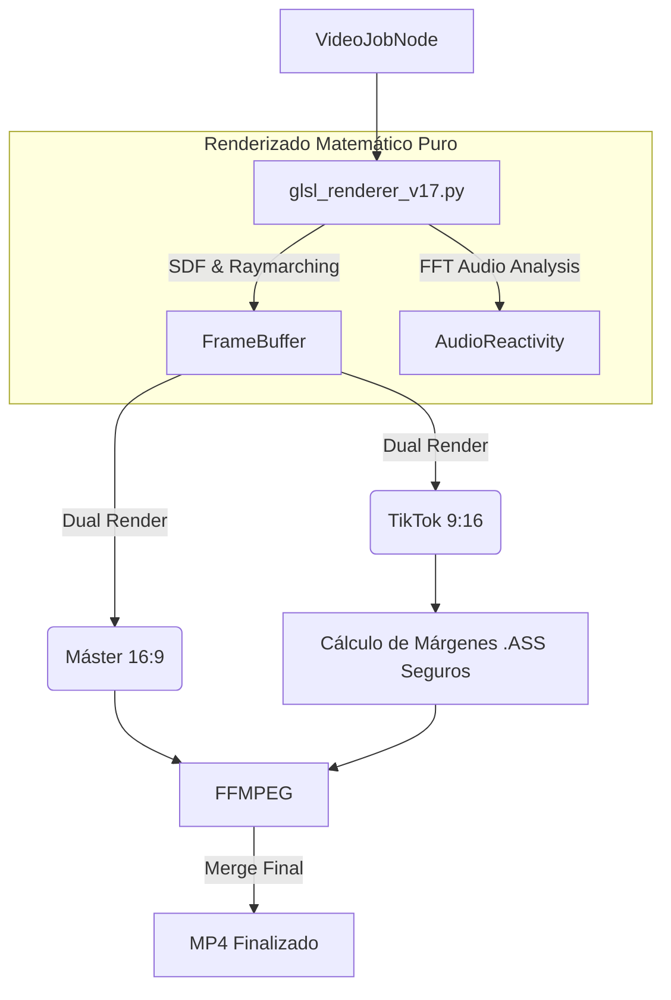
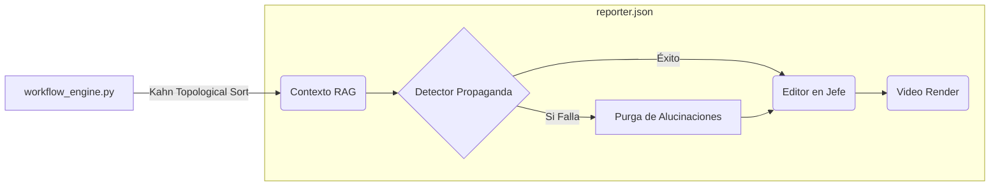

# Folio 3: Pipelines Multi-Agente y Herramientas (Gravity V30.0 MYTHOS)

Gravity no está confinado a una simple ventana de chat. Dispone de un arsenal de más de 25 herramientas forenses, de producción y de raspado de datos ubicadas en el directorio `tools/`. Estas herramientas son invocadas dinámicamente por los sub-agentes según requiera el ciclo OODA o el usuario.

## 1. La Forja Literaria (Producción de Libros y Ensayos)

Gravity tiene la capacidad de producir libros y ensayos enteros, estructurados, refinados y curados, actuando como un escuadrón de redactores de alto nivel con un blindaje QA extremo.

- **`book_writer.py` & `fiction_writer.py` & `research_writer.py`:** Motores de redacción profunda que fragmentan un esqueleto narrativo o temático y asignan sub-capítulos a los LLMs disponibles. Estos scripts manejan controles de continuidad avanzada y memoria comprimida.
- **`book_refiner.py` & `research_refiner.py`:** Editores en Jefe y Correctores de Estilo. Re-escriben capítulos del borrador en diferentes profundidades (polish, full, expand, enhance) utilizando OSINT y búsquedas académicas dinámicas.
- **`epub_generator.py` & `pdf_exporter.py`:** Ensambladores finales de alta gama. Empaquetan el formato Markdown/HTML en archivos ePub y PDFs comerciales con portadas dinámicas y estilo impecable.
- **Agente QA (`core/chapter_qa.py`):** Validador de continuidad y consistencia lógica anti-alucinaciones. Analiza las respuestas del LLM comparándolas con la sinopsis y el lore. Si falla, activa reintentos en caliente de forma totalmente integrada en el pipeline.
- **Métricas de Palabras Activas:** Todos los escritores y refinadores rastrean incrementalmente las métricas físicas del libro, guardando el conteo preciso de palabras por capítulo y totales en `progreso_metadata.json` o `progreso.json`.
- **Estandarización de Separadores:** Todos los motores de ensamblaje y empaquetado operan bajo el delimitador estricto `=== CAPITULO ===`, evitando falsos positivos con las reglas horizontales tradicionales del Markdown (`---`).
- **Modo HITL para Escaletas:** Intercepción humana (Human-in-the-Loop) opcional al inicio del pipeline que permite depurar y modificar la estructura de capítulos generada por el LLM antes de comenzar la producción en masa.

## 2. El Pipeline Cinematográfico (Motor GLSL V17)

En la carpeta `core/video/` reside el motor de renderizado asíncrono. Gravity no descarga videos de bancos de imágenes. Los calcula en su propia tarjeta gráfica.

- **Shaders Matemáticos (`glsl_renderer_v13.py`):** Utiliza código GLSL compilado para generar arte visual puro: Fractales (Mandelbulbs), Raymarching, PBR (Physically Based Rendering) Lighting y patrones reactivos al sonido (Extracción FFT de frecuencias graves y medias del audio).
- **Dual Render (Native Cropping):** Por cada trabajo, el motor renderiza simultáneamente:
  1. Versión `16:9` (Máster HD de alta transferencia) para consumo web o YouTube.
  2. Versión `9:16` para TikTok/Reels, inyectando subtítulos dinámicos `.ASS` que calculan matemáticamente los márgenes seguros, garantizando que los textos no se tapen con el botón de "Me Gusta".

## 3. Generación Visual y Colas (Fooocus Studio)

Gravity no solo produce texto o videos matemáticos. Posee un conector interno altamente acoplado con **Fooocus** (Stable Diffusion XL) para la generación de fotorealismo corporativo, *concept art* y miniaturas (thumbnails) de video.

- **Colas Asíncronas en SQLite:** Todo pedido de imagen se encola en `_image_queue.sqlite`. Si el usuario o el motor de Autonomía pide 500 imágenes para un libro entero, Gravity no crashea; despacha los fotogramas uno por uno mientras vigila que la VRAM no colapse, registrando eventos en `fooocus_trigger_debug.log`.
- **Inyección de Prompts Automatizada:** A través de herramientas como `image_generator_node`, el Cerebro deduce de qué trata un artículo de noticias e inventa el Prompt positivo y negativo perfecto, inyectándolo en Fooocus sin intervención.

## 4. Extracción de Datos y Forense Web

Gravity cuenta con múltiples formas de extraer sangre (datos) de la red, incluso si las APIs oficiales caen.

- **`firecrawl_scraper.py`:** Usa la API Firecrawl para devorar URLs limpiando porquería de Javascript, pero si falla el presupuesto, hace *fallback* inmediato a librerías locales crudas como BeautifulSoup.
- **`youtube_analyzer.py`:** Herramienta brutal. No solo descarga transcripciones enteras de videos (burlando protecciones), sino que pasa esos textos masivos por modelos locales para extraer insights corporativos, espiando estrategias de competidores.
- **`grep_tool.py`:** Herramienta de escaneo profundo Regex local. Invocado por los agentes (mediante `/grep`) para auditar de forma autónoma vulnerabilidades dentro de su propio repositorio.

## 5. El Orquestador de Flujos Topológicos (DAG)

## 5. El Orquestador de Flujos Topológicos (DAG)

A nivel subyacente, nada de esto se ejecuta secuencialmente. 
El archivo `core/workflow_engine.py` convierte archivos JSON (`workflows/reporter.json`) en **Grafos Dirigidos Acíclicos (Algoritmo de Kahn)**. 
- Mapea dependencias entre herramientas. Por ejemplo, el nodo de Video no arrancará hasta que el nodo de `book_refiner` haya emitido un payload exitoso.
- Si una herramienta falla (ej. *Fooocus* colapsa generando imágenes), el Grafo aísla el error, congela esa rama específica y mantiene al resto del sistema con vida, evitando un colapso en cascada del servidor.

### 5.1. Aislamiento Epistemológico (Realidad vs. Ficción)
A partir de la versión más reciente, el Orquestador y los workflows que alimentan portales en vivo (`essayist.json`, `reporter.json`, `scientist.json`) operan bajo estricto **aislamiento epistemológico**.
- Se desvinculó completamente el uso de la *Biblia de Lore* (`lore_bible.md`) de los flujos periodísticos y científicos, erradicando la contaminación narrativa (ej. términos de novelas de ciencia ficción).
- Estos agentes ahora se alimentan exclusivamente de **Manifiestos Editoriales** (`perspectiva_ensayos.md` y `perspectiva_ciencia.md`), que obligan al LLM a analizar el mundo usando teoría de sistemas, sociología, filosofía política real y bases empíricas (peer-reviewed).
- Los workflows agnósticos (como `book_full.json`) mantienen la capacidad de escribir ficción si el usuario inyecta deliberadamente un archivo de lore como parámetro de entrada.

## 6. J.A.R.V.I.S Sensory Tools & Herramientas V30.0 MYTHOS

La evolución hacia el protocolo J.A.R.V.I.S dota a Gravity de herramientas digitales, espaciales, físicas y **proactivas**, cerrando la brecha entre la terminal y el mundo real.

- **`sentinel_core.py`:** El Lóbulo Frontal Proactivo. Se engancha al Sensory Bus, acumula contexto de la pantalla y la temperatura, y decide de forma autónoma (usando LLaMA3) si debe hablarte o alertarte, sin requerir prompts del usuario.
- **`voice_daemon.py` (V2):** Oídos y Cuerdas Vocales perfectas. Usa `SpeechRecognition` para una detección de silencio dinámico (True VAD) y sintetiza voz hiper-realista en milisegundos usando **Microsoft Edge-TTS** y `pygame`.
- **`vision_tool.py` & `overwatch_daemon.py`:** Utilizan `mss` para capturar el framebuffer de tus monitores a alta velocidad. Gravity puede "ver" pasivamente lo que haces, interpretando el contexto visual mediante LLMs ligeros (como Moondream2 o LLaVA).
- **`os_controller.py`:** Las "Manos" cibernéticas. Otorga al LLM la capacidad de invocar `pyautogui` para controlar el ratón y el teclado de forma autónoma, manipulando la UI de Windows si las APIs estándar fallan.
- **`iot_controller.py` (V30.0):** Integra el motor con redes domóticas locales (Home Assistant). Realiza consultas REST reales a `/api/states` recuperando el estado verídico de sensores perimetrales, cámaras y alarmas.
- **`thermal_watchdog.py` (V30.0):** Sistema biológico de supervivencia activa. Monitorea temperaturas mediante WMI y, al superar los 85°C, utiliza `psutil` para suspender dinámicamente subprocesos pesados (`ollama`, `ffmpeg`, `comfyui`), reanudándolos automáticamente al enfriar a <75°C.
- **`tinka_engine.py` (V30.0):** Motor de análisis y estadística predictiva para loterías. Realiza scraping masivo en vivo de resultados y calcula frecuencias relativas reales almacenadas en la base de datos `tinka_history.db`.
