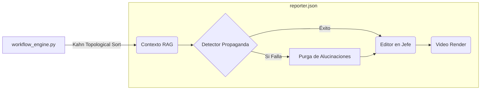

# Folio 3: Pipelines Multi-Agente y Herramientas (Gravity V16.3 PRO)

Gravity no está confinado a una simple ventana de chat. Dispone de un arsenal de más de 25 herramientas forenses, de producción y de raspado de datos ubicadas en el directorio `tools/`. Estas herramientas son invocadas dinámicamente por los sub-agentes según requiera el ciclo OODA o el usuario.

## 1. La Forja Literaria (Producción de Libros y Ensayos)

Gravity tiene la capacidad de producir libros enteros, estructurados, refactados y curados, actuando como un escuadrón de escritores fantasma.

- **`book_writer.py` & `fiction_writer.py`:** Motores de redacción profunda que fragmentan un esqueleto narrativo y asignan sub-capítulos a los LLMs disponibles. Estos scripts manejan control de continuidad.
- **`book_refiner.py`:** Actúa como Editor en Jefe y Corrector de Estilo. Expande textos estériles para darles la narrativa filosófica y oscura característica de *La Voluntad Soberana*.
- **`epub_generator.py`:** Ensamblador final. Empaqueta el formato Markdown/HTML en archivos ePub comerciales listos para ser distribuidos o vendidos.

## 2. El Pipeline Cinematográfico (Motor GLSL V17)

En la carpeta `core/video/` reside el motor de renderizado asíncrono. Gravity no descarga videos de bancos de imágenes. Los calcula en su propia tarjeta gráfica.

- **Shaders Matemáticos (`glsl_renderer_v13.py`):** Utiliza código GLSL compilado para generar arte visual puro: Fractales (Mandelbulbs), Raymarching, PBR (Physically Based Rendering) Lighting y patrones reactivos al sonido (Extracción FFT de frecuencias graves y medias del audio).
- **Dual Render (Native Cropping):** Por cada trabajo, el motor renderiza simultáneamente:
  1. Versión `16:9` (Máster HD de alta transferencia) para consumo web o YouTube.
  2. Versión `9:16` para TikTok/Reels, inyectando subtítulos dinámicos `.ASS` que calculan matemáticamente los márgenes seguros, garantizando que los textos no se tapen con el botón de "Me Gusta".

## 3. Generación Visual y Colas (Fooocus Studio)

Gravity no solo produce texto o videos matemáticos. Posee un conector interno altamente acoplado con **Fooocus** (Stable Diffusion XL) para la generación de fotorealismo corporativo, *concept art* y miniaturas (thumbnails) de video.

- **Colas Asíncronas en SQLite:** Todo pedido de imagen se encola en `_image_queue.sqlite`. Si el usuario o el motor de Autonomía pide 500 imágenes para un libro entero, Gravity no crashea; despacha los fotogramas uno por uno mientras vigila que la VRAM no colapse, registrando eventos en `fooocus_trigger_debug.log`.
- **Inyección de Prompts Automatizada:** A través de herramientas como `image_generator_node`, el Cerebro deduce de qué trata un artículo de noticias e inventa el Prompt positivo y negativo perfecto, inyectándolo en Fooocus sin intervención.

## 4. Extracción de Datos y Forense Web

Gravity cuenta con múltiples formas de extraer sangre (datos) de la red, incluso si las APIs oficiales caen.

- **`firecrawl_scraper.py`:** Usa la API Firecrawl para devorar URLs limpiando porquería de Javascript, pero si falla el presupuesto, hace *fallback* inmediato a librerías locales crudas como BeautifulSoup.
- **`youtube_analyzer.py`:** Herramienta brutal. No solo descarga transcripciones enteras de videos (burlando protecciones), sino que pasa esos textos masivos por modelos locales para extraer insights corporativos, espiando estrategias de competidores.
- **`grep_tool.py`:** Herramienta de escaneo profundo Regex local. Invocado por los agentes (mediante `/grep`) para auditar de forma autónoma vulnerabilidades dentro de su propio repositorio.

## 5. El Orquestador de Flujos Topológicos (DAG)

A nivel subyacente, nada de esto se ejecuta secuencialmente. 
El archivo `core/workflow_engine.py` convierte archivos JSON (`workflows/reporter.json`) en **Grafos Dirigidos Acíclicos (Algoritmo de Kahn)**. 
- Mapea dependencias entre herramientas. Por ejemplo, el nodo de Video no arrancará hasta que el nodo de `book_refiner` haya emitido un payload exitoso.
- Si una herramienta falla (ej. *Fooocus* colapsa generando imágenes), el Grafo aísla el error, congela esa rama específica y mantiene al resto del sistema con vida, evitando un colapso en cascada del servidor.
