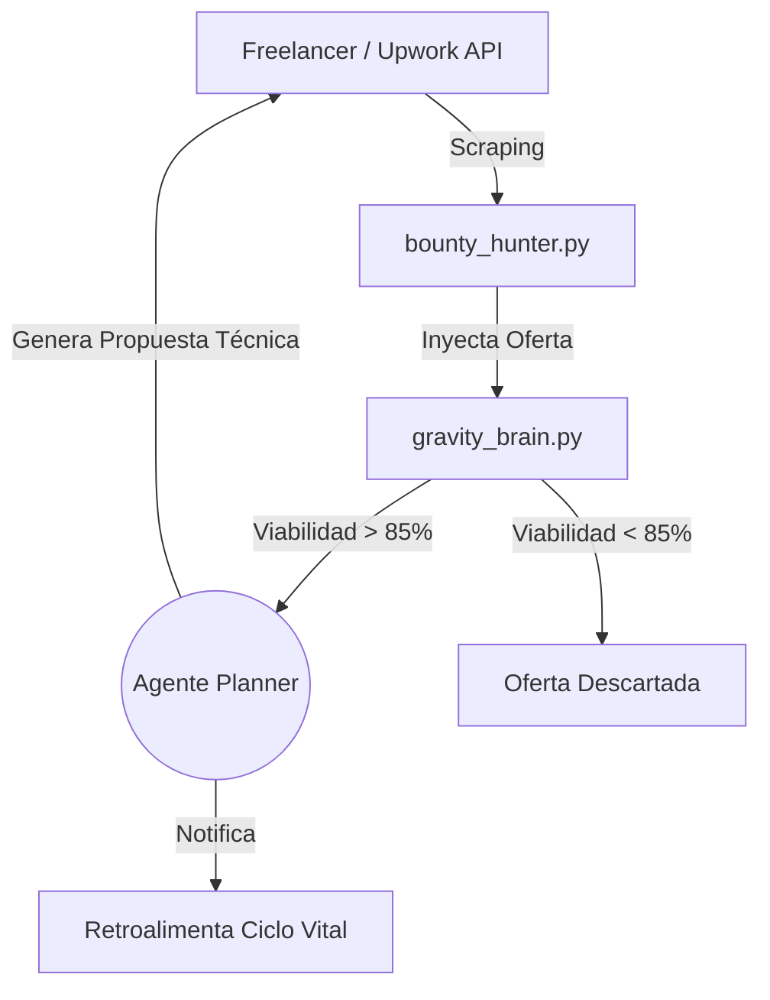
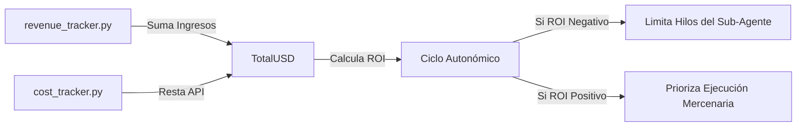

# Folio 4: Monetización y Flotas Mercenarias (Gravity V16.3 PRO)

Gravity no es una caja de arena para experimentos lúdicos. Es un sistema económico auto-sustentable diseñado para buscar oportunidades de negocio en internet, cazar contratos (Bounties) y generar ingresos pasivos, alimentando su propio ciclo de vida y financiando sus llamadas API.

## 1. El Cazador de Contratos (Bounty Hunter)

El archivo `bounty_hunter.py` representa el ala mercenaria de Gravity. 

- **Escaneo de Plataformas:** Se infiltra silenciosamente en APIs (o escrapea cuando las APIs son de pago) de plataformas de trabajo remoto como Freelancer, Upwork o foros corporativos de bounties de código.
- **Evaluación de Viabilidad (Heurística de IA):** Gravity no aplica a cualquier trabajo ciegamente. Descarga el requerimiento técnico y lo inyecta en su Cerebro (`gravity_brain.py`). El LLM audita el contrato y se pregunta: *"¿Soy capaz de automatizar esto o de redactar este código con mis herramientas actuales?"*
- **Redacción de Propuestas:** Si el umbral de viabilidad supera el 85%, el Sub-Agente Planner redacta una propuesta técnica comercial altamente agresiva y atractiva, postulando el perfil del humano anfitrión a la oferta de trabajo de forma completamente autónoma.

## 2. El Agente Infiltrador (`infiltrator.py`)

A diferencia del cazador pasivo, este módulo está diseñado para infiltrarse en redes y bases de datos más herméticas, rastrear proyectos abandonados o en etapa de *seed funding* que requieran inyección de código urgente o automatización. Es el brazo de inteligencia y reconocimiento (Recon) del sistema.

## 3. Fábrica de Productos Pasivos

Para evitar depender de contratos directos, Gravity emplea fábricas de dinero asíncronas, forjando productos listos para la venta o monetización por anuncios:

- **Generador de Cursos (`course_generator.py`):** Un nodo específico que, al detectar una tendencia (Ej: "IA Generativa para Finanzas"), extrae libros, foros y wikis. El LLM estructura un temario universitario. Acto seguido, envía los *prompts* al Motor V17 (`video_pipeline.py`) y genera las lecciones audiovisuales completas, empaquetadas y listas para subir a plataformas de venta o listas de YouTube.
- **Periodista Autónomo (El Nexo Ágora):** Detecta noticias virales, purga la propaganda mediante su filtro de sesgos en `reporter.json`, redacta artículos incisivos en formato Markdown y hace un `git push` directo a Netlify para monetizar blogs propios (con AdSense o afiliación). Todo esto en 15 segundos sin intervención humana.

## 4. Retroalimentación OODA (Revenue Tracker)

Todos los movimientos de estas flotas son monitoreados por el módulo `revenue_tracker.py` y `cost_tracker.py`. 
1. Al despertar cada 6 horas en su Ciclo OODA, Gravity calcula la métrica **ROI Cibernético**: *(Ingresos Netos Raspeados) - (Costo Diario API).*
2. Si el sistema ve que un sub-agente cazador (ej. generador de contenido YouTube) está operando en déficit, el OODA loop reduce sus recursos de hilo computacional y prioriza al Agente que esté generando más *Bounties* efectivos.

> [!CAUTION]
> El despliegue de las flotas mercenarias puede violar los Términos de Servicio de algunas plataformas por operar a un ritmo no humano. Gravity incluye rotación dinámica para ofuscar su firma algorítmica, mitigando las expulsiones. Sujeto siempre a tu aprobación en la cola HITL.
