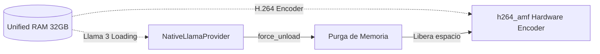

# Architecture Deep Dive (V17 Omniscient-Tier)

Gravity AI Bridge opera mediante una arquitectura altamente modular y resistente a fallos diseñada específicamente para entornos de recursos compartidos (como el Ryzen 7 8700G).

## 1. El Workflow Engine (`core/workflow_engine.py`)
El corazón del ecosistema. Ejecuta grafos dirigidos acíclicos (DAGs) definidos en JSON.
- **Auto-cargado de Nodos:** Dinámicamente escanea `core/nodes/` e inyecta las clases heredadas de `GravityNode`.
- **Persistencia Zombie:** Si el servidor se apaga abruptamente, la cola SQLite (`_video_queue.sqlite`) mantiene los trabajos "running" para poder ser reseteados.
- **Inyección Dinámica de Variables:** Utiliza sintaxis Jinja-like (`{{nodo.variable}}`) para encadenar las salidas de un modelo IA como entrada del siguiente nodo en tiempo de ejecución.

## 2. Optimizaciones de Hardware (AMD APU)
Para proteger la RAM unificada compartida entre CPU y GPU, Gravity implementa:

- **Kill-Switch de LLMs (`NativeLlamaProvider.force_unload()`)**: Inyectado directamente en `video_job_node.py`. Justo antes de que FFmpeg o ComfyUI asalten la VRAM, este interruptor oblitera el modelo de lenguaje de la memoria, garantizando que el pipeline visual tenga todo el espacio necesario.
- **Aceleración H.264 AMF**: Se purgó `libx264` del ecosistema. Todos los motores, desde `video_slicer` hasta el renderizado GLSL, inyectan `-c:v h264_amf` nativamente, logrando velocidades de codificación de 4x en hardware AMD Radeon sin estresar la CPU.

## 3. High Frequency Radar
Demonio independiente (`core/high_frequency_radar.py`) que:
- Escanea RSS globales (ej: Google News) cada 60 segundos.
- Busca keywords de emergencia (*"colapso"*, *"guerra"*, *"alerta"*).
- Interrumpe pacíficamente el flujo e inyecta la crisis directamente en el motor principal invocando `run_workflow('reporter')` de forma no bloqueante.
