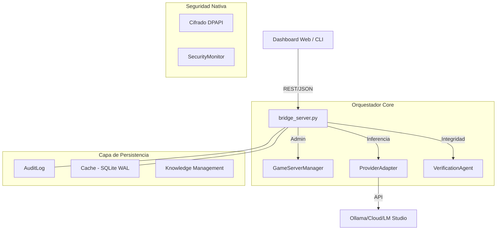

# 🧱 Arquitectura Técnica — Gravity AI Bridge V10.0

Gravity AI Bridge no es solo un servidor proxy; es una capa de orquestación reactiva que sincroniza múltiples estados del sistema. Aquí se detallan los pilares técnicos de su funcionamiento.

## 📊 Flujo de Datos Global

## 🔐 Seguridad y Cifrado (DPAPI)
A diferencia de otros puentes que guardan llaves en `.env` (texto plano), Gravity utiliza la **Data Protection API (DPAPI)** de Windows.
- Las API Keys se cifran utilizando la entropía del usuario logueado.
- Los secretos son ilegibles incluso para otros usuarios administradores del mismo PC.
- Esto elimina el riesgo de fuga accidental de llaves en commits de Git o volcados de memoria genéricos.

## 💾 Persistencia y Modo WAL
Para soportar el monitoreo en tiempo real del dashboard sin degradar el rendimiento, el archivo `_cache.sqlite` opera en **Write-Ahead Logging (WAL) Mode**:
- Permite que múltiples hilos de lectura (Dashboard) y un hilo de escritura (IA Backend) trabajen simultáneamente.
- Garantiza **Atomicidad y Durabilidad (ACID)** incluso ante apagones repentinos del sistema.

## 🧠 Gestión de Contexto (Sliding Window)
El bridge gestiona la memoria de las sesiones mediante un algoritmo de **Ventana Deslizante**:
- Cuando el historial supera el límite de tokens del modelo (ej: 128k para Claude), el bridge recorta los mensajes más antiguos, manteniendo siempre el *System Prompt* y los mensajes más recientes.
- Esto previene errores de `context_length_exceeded` y mantiene la fluidez de la conversación.

## 🛡️ Watchdog System
El `SecurityMonitor` opera en un bucle asíncrono cada 10 segundos:
- Realiza verificaciones de hashes SHA-256 en archivos críticos.
- Audita la tabla de sockets abiertos de Windows para asegurar que solo los puertos definidos en la `WHITELIST_PORTS` estén en escucha.
- Emite eventos al Dashboard mediante el canal de auditoría interno.

---
*Documentación Arquitectónica Diamond-Tier.*
