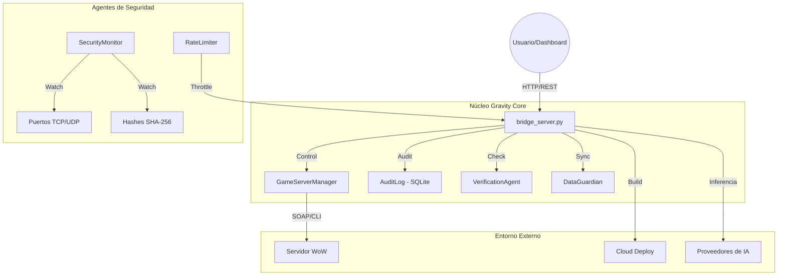

# 🧱 Arquitectura Deep-Dive — Gravity AI Bridge

Gravity AI Bridge V10.0 está diseñado bajo un paradigma de **Orquestación Asíncrona basada en Servicios**. A diferencia de los servidores web tradicionales, el Bridge actúa como un kernel que gestiona la comunicación entre la lógica local (Python) y los estados volátiles del sistema (Procesos de juego, APIs externas).

## 📊 Diagrama de Arquitectura Global

## 🔹 Componentes del Núcleo

### 1. Servidor de Enlace (bridge_server.py)
Es el único punto de entrada autorizado. Utiliza `http.server` de Python de forma asíncrona para manejar peticiones de inferencia chat, auditoría y control de sistema.Centraliza las cabeceras CORS y el manejo de errores global (HTTP 500 saneado).

### 2. Guardián de Datos (DataGuardian)
Gestiona la "memoria" del sistema a través del archivo `_knowledge.json`. Se encarga de la sincronización de versiones y asegura que el Bridge siempre tenga una personalidad unitaria.

### 3. Verification Agent
Actúa como un linter dinámico. Antes de ejecutar cambios críticos (ej: editar archivos Lua de WoW o configurar APIs), el `VerificationAgent` audita la sintaxis y el balanceo de bloques para evitar estados inconsistentes.

## 🔒 Modelo de Seguridad

Gravity Bridge utiliza el modelo **Diamond-Tier Security**:
- **Cifrado en Reposo:** Las API Keys nunca se guardan en texto plano. Se delegan al subsistema `cryptography` que llama a la API **DPAPI** de Windows. Esto vincula la seguridad al usuario físico de la máquina.
- **Micro-Auditoría:** Cada token generado por la IA es registrado en el `AuditLog` (SQLite), permitiendo un desglose de costos y latencias milimétrico.
- **Modo WAL (Write-Ahead Logging):** La base de datos SQLite opera en modo WAL para permitir lectura/escritura simultánea sin bloqueos de archivo, vital para el monitoreo en tiempo real del dashboard.

## ⚡ Manejo de Concurrencia
El sistema utiliza un pool de hilos (`ThreadedHTTPServer`) para evitar que consultas largas de IA (que pueden tardar segundos) bloqueen las métricas de monitoreo de seguridad, las cuales se ejecutan en intervalos de 10 segundos de forma independiente.

---
*Documento Técnico V10.0 - DarckRovert.*
