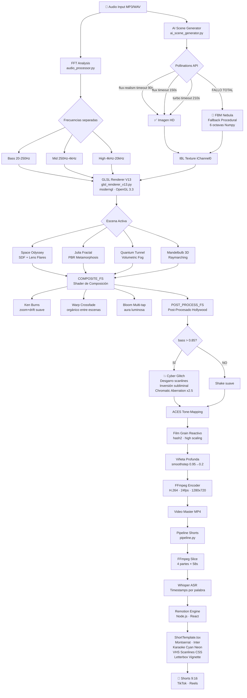

# ⚙️ Arquitectura del Sistema — Gravity AI Bridge V16.0 PRO

Este documento describe la arquitectura completa del ecosistema, con foco especial en el **Motor Cinematic V2.0 PBR** incorporado en V16.0.

---

## 🏛 Vista General del Ecosistema

```
┌─────────────────────────────────────────────────────────┐
│               Gravity AI Bridge V16.0 PRO               │
│              bridge_server.py  (puerto 7860)             │
│            ThreadingHTTPServer · OpenAI-compat           │
└──────────────┬──────────────────────────────────────────┘
               │
   ┌───────────┼───────────────────────────────┐
   │           │                               │
   ▼           ▼                               ▼
Frontend   Core Modules                  Integrations
React SPA  (/core/)                      (/integrations/)
Vite+TS    multi_agent · hitl            Fooocus · ComfyUI
           session_runner · rag          FasterLivePortrait
           security · watchdog           MangosD · OBS
           video/ · obs_client           FabricaWeb
```

---

## 🎬 Video Pipeline Híbrido — Flujo Completo V2.0 PBR

El pipeline de videoclip musical es el componente más complejo del ecosistema. Orquesta análisis de audio, inteligencia artificial generativa, shaders GLSL en tiempo real y React/Node para producir contenido audiovisual de calidad Hollywood desde una GPU integrada.


```mermaid
flowchart TD
    A[🎵 Audio Input MP3/WAV] --> B[FFT Analysis\naudio_processor.py]
    B --> C{Frecuencias separadas}
    C --> C1[Bass 20-250Hz]
    C --> C2[Mid 250Hz-4kHz]
    C --> C3[High 4kHz-20kHz]

    A --> D[AI Scene Generator\nai_scene_generator.py]
    D --> D1{Pollinations API}
    D1 -->|flux-realism timeout 90s| D2[✅ Imagen HD]
    D1 -->|flux timeout 150s| D2
    D1 -->|turbo timeout 210s| D2
    D1 -->|FALLO TOTAL| D3[🌌 FBM Nebula\nFallback Procedural\n6 octavas Numpy]
    D2 --> E[IBL Texture iChannel0]
    D3 --> E

    C1 & C2 & C3 --> F[GLSL Renderer V13\nglsl_renderer_v13.py\nmoderngl · OpenGL 3.3]
    E --> F

    F --> G{Escena Activa}
    G --> G1[Space Odyssey\nSDF + Lens Flares]
    G --> G2[Julia Fractal\nPBR Metamorphosis]
    G --> G3[Quantum Tunnel\nVolumetric Fog]
    G --> G4[Mandelbulb 3D\nRaymarching]

    G1 & G2 & G3 & G4 --> H[COMPOSITE_FS\nShader de Composición]
    H --> H1[Ken Burns\nzoom+drift suave]
    H --> H2[Warp Crossfade\norgánico entre escenas]
    H --> H3[Bloom Multi-tap\naura luminosa]

    H --> I[POST_PROCESS_FS\nPost-Procesado Hollywood]
    I --> I1{bass > 0.85?}
    I1 -->|SÍ| I2[💥 Cyber Glitch\nDesgarro scanlines\nInversión subliminal\nChromatic Aberration x2.5]
    I1 -->|NO| I3[Shake suave]
    I2 & I3 --> I4[ACES Tone-Mapping]
    I4 --> I5[Film Grain Reactivo\nhash2 · high scaling]
    I5 --> I6[Viñeta Profunda\nsmoothstep 0.95→0.2]

    I6 --> J[FFmpeg Encoder\nH.264 · 24fps · 1280x720]
    J --> K[Video Master MP4]

    K --> L[Pipeline Shorts\npipeline.py]
    L --> L1[FFmpeg Slice\n4 partes × 58s]
    L1 --> L2[Whisper ASR\nTimestamps por palabra]
    L2 --> L3[Remotion Engine\nNode.js · React]
    L3 --> L4[ShortTemplate.tsx\nMontserrat · Inter\nKaraoke Cyan Neon\nVHS Scanlines CSS\nLetterbox Vignette]
    L4 --> M[📱 Shorts 9:16\nTikTok · Reels]
```

---

## 🔧 Shaders GLSL — Descripción Técnica

### Uniforms Globales (todos los Fragment Shaders)

| Uniform | Tipo | Descripción |
|---|---|---|
| `iChannel0` | `sampler2D` | Textura IBL (imagen AI o fallback 1×1 negro) |
| `time` | `float` | Tiempo absoluto en segundos |
| `bass` | `float` | Amplitud normalizada 20-250 Hz |
| `mid` | `float` | Amplitud normalizada 250 Hz-4 kHz |
| `high` | `float` | Amplitud normalizada 4-20 kHz |
| `pan` | `float` | Balance estéreo izquierda/derecha |
| `resolution` | `vec2` | Dimensiones del framebuffer en píxeles |
| `colorA/B` | `vec3` | Paleta de color de la escena activa |

### Escenas Disponibles

| ID | Shader | Técnica 3D |
|---|---|---|
| `biomechanic_v13` | `SPACE_ODYSSEY_FS` | SDF esférico + Lens Flares espectrales |
| `julia_v13` | `JULIA_FS` | Fractal Julia Set 3D + Metamorfosis PBR |
| `quantum_v13` | `QUANTUM_TUNNEL_FS` | Túnel SDF + Niebla Volumétrica + IBL |
| `mandelbulb_v13` | `MANDELBULB_FS` | Mandelbulb 8th Power + Raymarching 80it |

### Pipeline de Composición

```
tex_base (AI img)  ──────────────────────┐
tex_base2 (AI img) ──► Ken Burns zoom    │
                    ──► Chromatic Ab.    │
                    ──► Crossfade        ├──► COMPOSITE_FS ──► fbo_composite
tex_overlay (GLSL) ──► Alpha por Luma   │
tex_overlay2 (GLSL)──► Warp Transition  │
                    ──► Bloom Multi-tap  │
                                         │
uniforms (bass, mid, high, time, ...) ───┘
                                         
fbo_composite ──► POST_PROCESS_FS ──► Frame Final PNG
```

---

## 🌌 Fallback Procedural — Nebulosa Fractal FBM

Cuando Pollinations falla tras los 3 modelos en cascada, el sistema activa este algoritmo en Numpy para generar un fondo de IBL visualmente rico:

```
Parámetros:
  resolución: 512×512 px (formato RGBA float32)
  octavas FBM: 6
  semilla: aleatoria por escena

Algoritmo:
  1. Capa Base: noise octavas 1→6 con frecuencias
     2^0, 2^1, ... 2^5 y amplitudes 0.5^0 ... 0.5^5
  2. Filtro Gaussiano σ=2 → suavizado de bordes
  3. Capa de Gas Cósmico: 2ª FBM rotada 45° mezclada
     con la primera usando blend multiplicativo
  4. Colorización: gradiente HSL dinámico (azul-violeta-cyan)
  5. Puntos Estelares: 500 píxeles aleatorios con
     brillo exponencial (estrella brillante vs fondo)
  6. Viñeta Perimetral: multiplicación gaussiana radial
```

---

## 📦 Estructura del Paquete `/core/video/`

```
core/video/
├── __init__.py
├── pipeline.py          # Daemon SQLite WAL, worker threads, job dispatch
├── glsl_renderer_v13.py # Motor OpenGL PBR — todos los shaders GLSL
├── ai_scene_generator.py# Generador AI + Fallback FBM
├── audio_processor.py   # FFT, TTS, BGM, sidechain compression
├── script_builder.py    # Multi-agent scripting, Research, Lore context
└── renderer.py          # Ken Burns, Remotion, FFmpeg concat
```

---

## 🧠 Arquitectura Multi-Agente

```
bridge_server.py (Entry Point)
       │
       ├─► core/multi_agent.py      ◄── LLM APIs (Ollama/OpenAI/Anthropic)
       │       ├── Voting Consensuado
       │       ├── Debate 3-5 Modelos
       │       └── Agent Routing por Rol
       │
       ├─► core/session_runner.py   ◄── Subprocesos aislados (hasta 32)
       │       └── Roles: auditor · planner · coder · researcher · executor
       │
       ├─► core/hitl_manager.py     ◄── Cola de aprobación humana (120s timeout)
       │       └── Tools interceptados: code_runner, shell_exec, file_write...
       │
       ├─► core/engine_watchdog.py  ◄── Monitor de backends, Turbo KV-Cache & Memory Guard
       │       └── OLLAMA_KV-Cache, watchdog dinámico RAM (psutil), y desalojo LRU
       │
       ├─► core/security_monitor.py ◄── Whitelist dinámica + Anti-DDoS + GeoIP
       │
       └─► core/video/              ◄── Pipeline Multimedia (ver arriba)
```

---

## 🔌 Endpoints REST Principales

| Método | Ruta | Módulo | Descripción |
|---|---|---|---|
| `POST` | `/v1/chat/completions` | `multi_agent` | Chat LLM con streaming SSE |
| `POST` | `/v1/video/create` | `pipeline` | Encolar nuevo job de video |
| `GET` | `/v1/video/status` | `pipeline` | Estado del job activo |
| `GET` | `/v1/video/stream` | `renderer` | Stream MP4 al reproductor |
| `POST` | `/v1/sessions/spawn` | `session_runner` | Crear sub-agente con rol |
| `POST` | `/v1/hitl/approve` | `hitl_manager` | Aprobar acción de alto riesgo |
| `POST` | `/v1/hitl/reject` | `hitl_manager` | Rechazar acción de alto riesgo |
| `GET` | `/v1/hardware/stats` | `hardware` | GPU/VRAM/CPU en tiempo real |
| `POST` | `/v1/rag/toggle` | `rag` | Activar/desactivar inyección RAG |
| `POST` | `/v1/tools/scrape` | `firecrawl_scraper` | Scraping URL → Markdown |
| `GET` | `/v1/queue/stream` | `image_queue` | SSE stream de progreso Fooocus |
| `POST` | `/v1/agent/compare` | `multi_agent` | Comparación N modelos en paralelo |

---

## ⚡ Requisitos del Sistema

| Componente | Mínimo | Recomendado |
|---|---|---|
| OS | Windows 10 1809 x64 | Windows 11 23H2 |
| Python | 3.10 | 3.11+ |
| RAM | 8 GB | 16 GB+ |
| GPU | Intel UHD 620 (OpenGL 3.3) | NVIDIA RTX / AMD RX |
| VRAM | 0 MB (CPU fallback) | 4 GB+ |
| Node.js | 18 LTS | 20 LTS |
| ffmpeg | 6.0+ | 7.0+ |

> [!NOTE]
> El Motor GLSL PBR V13 está optimizado para GPUs integradas. Todos los shaders mantienen presupuesto de 16ms/frame (60fps) incluso en Intel UHD 620, evitando bucles anidados pesados y usando `smoothstep` en lugar de `pow` cuando es posible.

---

## 🏭 Motor de Workflows y Autonomía (V16.3 PRO)

Gravity incorpora un **Workflow Engine** (`core/workflow_engine.py`) estructurado como un Grafo Acíclico Dirigido (DAG).
Este sistema transforma scripts en "Líneas de Ensamblaje" (Archivos JSON en `/workflows/`) donde cada paso es un **Nodo Atómico**.

### 🧩 Nodos Atómicos Soportados
1. **RAGQueryNode**: Recupera contexto desde ChromaDB.
2. **WebSearchNode**: Scraping y DuckDuckGo en tiempo real.
3. **LLMQueryNode**: Orquesta Native Llama o APIs cloud (`provider_manager.complete`).

### ⚙️ Integración con Autonomy Engine
El `autonomy_engine.py` (OODA Loop) cuenta con un bypass de "Bajo Riesgo". Durante la fase DECIDE, el LLM puede invocar la ejecución nativa y asíncrona de cualquier Workflow de la carpeta `workflows/` utilizando `run_workflow("id")`. 
- **Topological Sort**: Kahn's algorithm resuelve el orden de ejecución basado en las dependencias declaradas en el JSON.
- **Background Threads**: Los workflows corren de manera no bloqueante permitiendo que el sistema de seguridad y métricas siga operando en paralelo.
