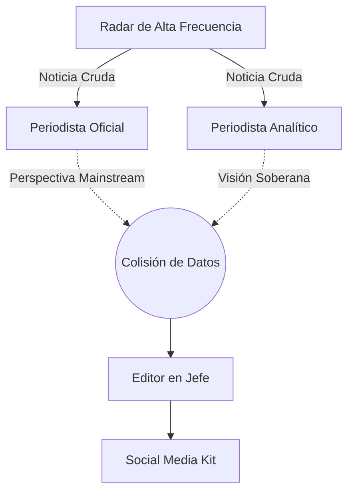
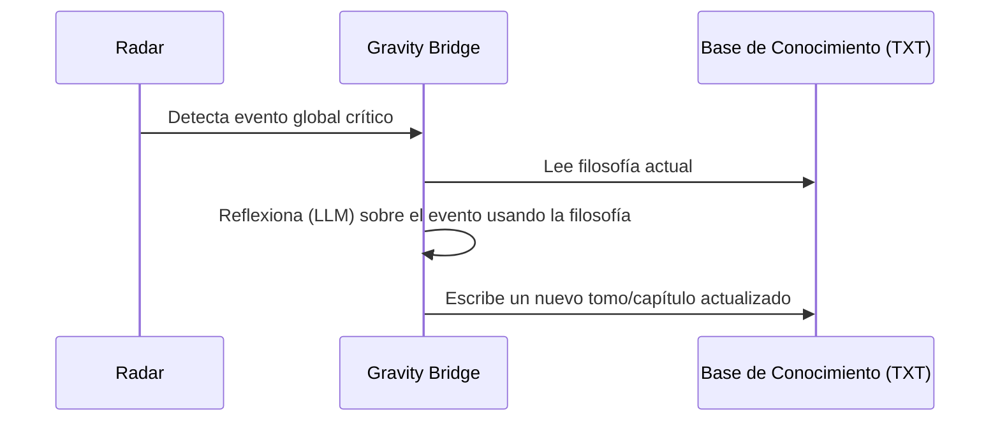

# Swarm Intelligence & Lore Expander

## 1. El Enjambre de Periodismo Dual (`reporter.json`)
En lugar de depender de un único llamado (Zero-Shot) para generar una noticia, Gravity utiliza **Swarm Intelligence**:

- **Nodo 1 (Postura Oficial):** Genera la visión mainstream de la noticia.
- **Nodo 2 (Postura Subversiva):** Genera una crítica profunda basada en la visión de "La Voluntad Soberana".
- **Nodo 3 (Síntesis del Editor):** Lee ambas posturas enfrentadas y redacta la versión definitiva.

El resultado se persiste localmente gracias al `FileWriterNode` que exporta un "Social Media Kit" para distribución manual.

## 2. Auto-Evolución de Filosofía (`lore_expander.json`)
El conocimiento del sistema no es estático.

Gravity implementa un ciclo de introspección:
1. `FileReader` lee el manifiesto actual (`libros_generados/La_Voluntad_Soberana_V3`).
2. Se inyectan las últimas noticias cubiertas como contexto.
3. Un `LLMQuery` especializado toma la filosofía base y redacta un nuevo capítulo o anexo explicando la situación actual a través de la óptica del sistema.
4. Un `FileWriter` graba este nuevo conocimiento en la base de datos de Lore, permitiendo a la entidad aprender permanentemente de su propia cobertura global.
